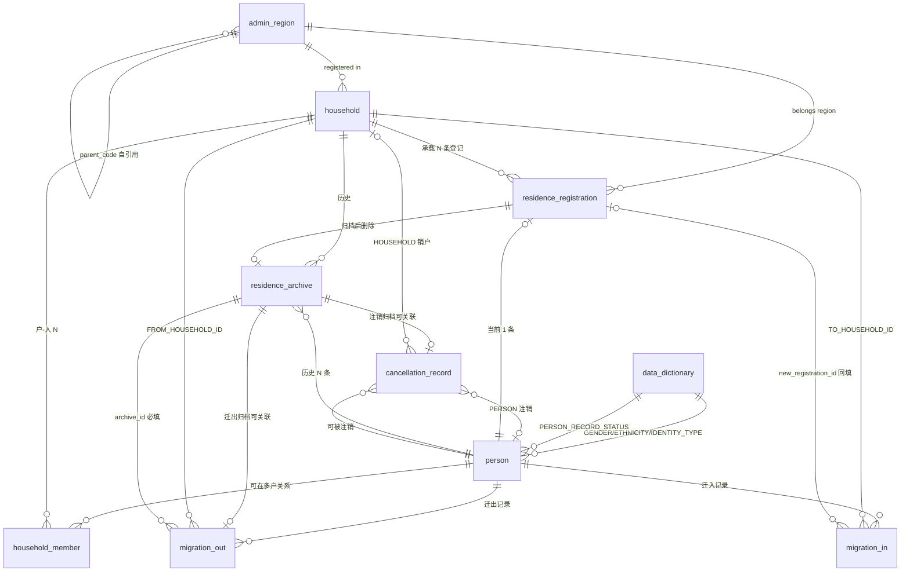

# E-R 图 v4.0（户籍与归档核心）

> 涉及 9 张职责内表：`admin_region`、`data_dictionary`、`person`、`household`、`household_member`、`residence_registration`、`residence_archive`、`migration_in`、`migration_out`、`cancellation_record`



## 关键一对一与一对多说明

| 关系 | 说明 |
|------|------|
| `person 1—0..1 residence_registration` | **强一对一**：通过 `UNIQUE KEY uk_registration_person(person_id)` 保证一人只能有一条当前有效登记。物理删除 + 归档 + INSERT 新登记配合迁移。 |
| `residence_registration N—1 household` | 一个户承载多条人口登记（户主、配偶、子女……）。 |
| `residence_registration 0..1—N residence_archive` | 一条当前登记可被迁出/注销多次归档。 |
| `household 1—N household_member` | 一户多人；但 active 户至多一条 `relationship_code='HEAD'` 且 `member_status='CURRENT'`。 |
| `household_member N—1 person` | 一人对应多条历史成员记录（多次入/离户）。 |

## 归档链

```
        迁出（CROSS_DISTRICT/EXTERNAL）                注销（PERSON）
        ┌─────────────────────────────────┐  ┌──────────────────────┐
        │ migration_out.complete(事务)   │  │ cancellation.complete │
        │  1) SELECT FOR UPDATE oldReg    │  │  1) SELECT FOR UPDATE  │
        │  2) INSERT residence_archive    │  │  2) INSERT archive    │
        │  3) DELETE residence_registration│  │  3) DELETE registration│
        │  4) household_member LEFT       │  │  4) member CANCELLED   │
        │  5) out.archive_id 回填         │  │  5) person CANCELLED   │
        └─────────────────────────────────┘  └──────────────────────┘
                            │
                            └────► 同一出口：residence_archive 单向历史表
```

## 业务方交互（不在本职范围）

- 居住证/居住登记：与 `residence_registration` 互为正交但**不共享外键**（居住证是居住事实，户籍是户籍事实）。
- 业务申请单 / 审批 / RBAC：上游工作流，通过 `source_application_id` 反向溯源，但物理隔离。
