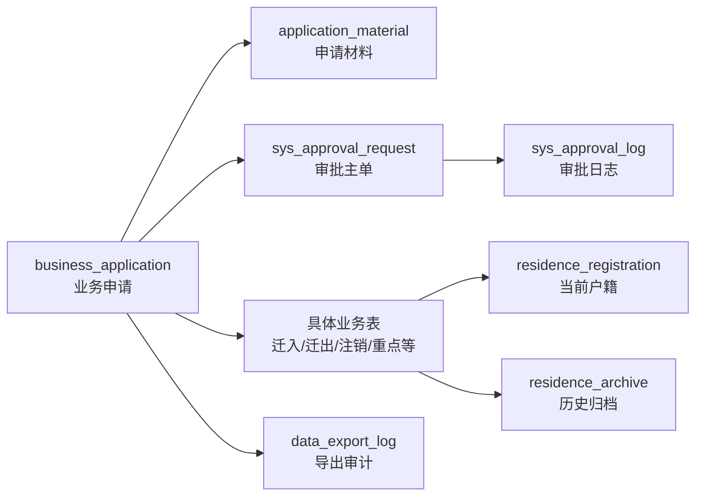
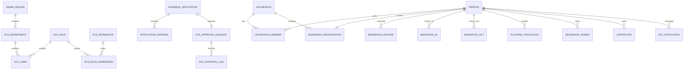

# 人口数据库管理系统数据库设计 v4.0 — Cursor 开发说明

> 来源：`数据库设计v4.0(2).xlsx`。本文按工作簿中的 25 张核心表、索引、约束、字典、权限、材料清单和视图设计整理，目标是让 Cursor 可直接据此生成 DDL、实体类、Mapper/Repository、Service 事务和接口校验。

## 1. 设计规模与总体结论

| 项目 | 数量 |
|---|---:|
| 核心表 | 25 |
| 字典类型 | 39 |
| 字典初始化项 | 159 |
| 索引定义 | 75 |
| 全局约束/事务规则 | 20 |
| 建议视图 | 4 |

### 1.1 核心设计思想

- **当前与历史分离**：`residence_registration` 只保存当前有效户籍；迁出或注销时，将完整快照写入 `residence_archive` 后删除当前记录。
- **统一业务主链路**：重大或需材料业务统一经过 `business_application → application_material → sys_approval_request/sys_approval_log → 具体业务表 → 归档/状态变更`。
- **三级权限模型**：角色等级 1/2/3、RBAC 权限点、数据范围 `ALL/DEPARTMENT/REGION/SELF`、重大业务审批共同生效。
- **稳定主档不冗余动态状态**：`person` 不保存当前户籍、流动人口、重点人口等可由业务表推导的状态。
- **核心数据不物理删除**：用户、人口、户籍、迁移、审批、归档和审计数据使用停用、状态、软删除或归档；核心外键默认 `ON DELETE RESTRICT`。
- **敏感数据最小化**：材料表只保存文件元数据与哈希；操作日志、导出日志必须脱敏；高敏导出必须审批。

### 1.2 主业务链路

### 1.3 核心实体关系

## 2. 表目录

| 序号 | 分层 | 表名 | 中文名称 | 字段数 | 主要职责 |
|---:|---|---|---|---:|---|
| 1 | 基础组织 | `admin_region` | 行政区划 | 7 | 行政区划不允许被引用后物理删除 |
| 2 | 基础组织 | `sys_department` | 部门机构 | 9 | 支撑按部门和区划的数据权限 |
| 3 | 权限控制 | `sys_role` | 角色 | 9 | 单用户单角色，权限等级1—3 |
| 4 | 权限控制 | `sys_permission` | 权限点 | 8 | 敏感权限标注是否需要审批 |
| 5 | 权限控制 | `sys_role_permission` | 角色权限关联 | 4 | 联合唯一约束防止重复授权 |
| 6 | 权限控制 | `sys_user` | 系统用户 | 12 | 用户停用，不物理删除 |
| 7 | 人口主档 | `person` | 人口基础身份档案 | 13 | 不存当前户籍和流动状态的冗余字段 |
| 8 | 户籍主档 | `household` | 家庭户档案 | 11 | 销户后保留主档并标记状态 |
| 9 | 统一申请 | `business_application` | 业务申请主单 | 17 | 申请—材料—审批—落表—归档主链路 |
| 10 | 材料管理 | `application_material` | 申请材料元数据 | 14 | 只存文件元数据与哈希，不存真实证件二进制 |
| 11 | 审批管理 | `sys_approval_request` | 审批主单 | 9 | 一申请一审批主单；重大业务要求3级 |
| 12 | 审批管理 | `sys_approval_log` | 审批过程日志 | 7 | 记录每一步动作和意见 |
| 13 | 户成员 | `household_member` | 户与人口历史关系 | 10 | 保留加入、迁出、注销历史 |
| 14 | 当前户籍 | `residence_registration` | 当前有效户籍登记 | 11 | 仅保存当前有效记录；一个人最多一条 |
| 15 | 历史归档 | `residence_archive` | 户籍历史快照 | 21 | 保存姓名、证件号、户号、地址等快照 |
| 16 | 迁入业务 | `migration_in` | 迁入业务记录 | 16 | 区分同市跨区和外来迁入 |
| 17 | 迁出业务 | `migration_out` | 迁出业务记录 | 14 | 办结后必须生成归档并移除当前登记 |
| 18 | 流动人口 | `floating_population` | 流动人口居住登记 | 19 | 记录到达、登记、预计/实际离开日期 |
| 19 | 居住凭证 | `residence_permit` | 临时登记凭证和居住证 | 14 | 与通用certificate职责分离 |
| 20 | 重点管理 | `key_population` | 重点人口管理记录 | 16 | 登记和解除均走申请审批 |
| 21 | 证件管理 | `certificate` | 通用人员证件 | 12 | 不再包含居住证 |
| 22 | 注销业务 | `cancellation_record` | 人口注销或家庭户销户 | 11 | 对象二选一；重大业务审批后落表 |
| 23 | 基础字典 | `data_dictionary` | 系统数据字典 | 7 | 联合唯一(dict_type, dict_code) |
| 24 | 审计日志 | `operation_log` | 关键操作日志 | 15 | 前后数据必须脱敏 |
| 25 | 导出审计 | `data_export_log` | 数据导出审计 | 13 | 记录条件摘要、行数、文件哈希和审批 |

## 3. 每张表的详细设计

### 3.1 `admin_region` — 行政区划

- **所属分层**：基础组织
- **职责**：行政区划不允许被引用后物理删除
- **主要关联对象**：sys_department、household、户籍/迁移/流动人口
- **关系基数**：1:N
- **主键**：`region_code`
- **使用字典**：`region_level_code` → REGION_LEVEL
- **外键数量**：1

#### 字段定义

| 序号 | 字段名 | 中文名 | 类型 | NULL | 主键 | 默认值 | 外键/约束 | 说明 |
|---:|---|---|---|---|---|---|---|---|
| 1 | `region_code` | 行政区划编码 | `VARCHAR(20)` | NOT NULL | 是 | `—` | 主键 | 采用统一行政区划编码，不使用自增 |
| 2 | `region_name` | 行政区划名称 | `VARCHAR(100)` | NOT NULL | 否 | `—` | — | 省、市、区县、街道或社区名称 |
| 3 | `parent_code` | 父级区划编码 | `VARCHAR(20)` | NULL | 否 | `NULL` | FK admin_region(region_code)，ON DELETE RESTRICT | 根节点可为空 |
| 4 | `region_level_code` | 区划层级编码 | `VARCHAR(20)` | NOT NULL | 否 | `—` | 字典 REGION_LEVEL | 省/市/区县/街道/社区 |
| 5 | `city_code` | 所属城市编码 | `VARCHAR(20)` | NULL | 否 | `NULL` | 普通索引 | 用于判断是否属于同市跨区 |
| 6 | `enabled_flag` | 启用标记 | `TINYINT` | NOT NULL | 否 | `1` | CHECK enabled_flag IN (0,1) | 1启用，0停用 |
| 7 | `sort_no` | 排序号 | `INT` | NOT NULL | 否 | `0` | — | 同层级展示顺序 |

#### 索引

| 索引名 | 字段 | 类型 | 目的 |
|---|---|---|---|
| `pk_admin_region` | `region_code` | PRIMARY | 主键 |
| `idx_admin_region_parent` | `parent_code` | INDEX | 层级查询 |
| `idx_admin_region_city` | `city_code` | INDEX | 同市跨区判断 |

#### 实现要点

- 使用行政区划编码作为自然主键，不使用自增 ID；支持省/市/区县/街道/社区树形结构。
- `parent_code` 自关联且采用 `ON DELETE RESTRICT`，被下级或业务数据引用的区划不能物理删除。
- `city_code` 是为“同市跨区”判断准备的查询字段，需在区划初始化时保持一致。

### 3.2 `sys_department` — 部门机构

- **所属分层**：基础组织
- **职责**：支撑按部门和区划的数据权限
- **主要关联对象**：sys_user、household、business_application、流动人口
- **关系基数**：1:N
- **主键**：`department_id`
- **唯一约束/唯一索引**：`uk_department_code` (`department_code`)
- **使用字典**：`department_type_code` → DEPARTMENT_TYPE；`status` → ACCOUNT_STATUS
- **外键数量**：2

#### 字段定义

| 序号 | 字段名 | 中文名 | 类型 | NULL | 主键 | 默认值 | 外键/约束 | 说明 |
|---:|---|---|---|---|---|---|---|---|
| 1 | `department_id` | 部门ID | `BIGINT` | NOT NULL | 是 | `—` | 主键，自增 | — |
| 2 | `department_code` | 部门编码 | `VARCHAR(50)` | NOT NULL | 否 | `—` | 唯一 | 如派出所、街道、社区等机构编码 |
| 3 | `department_name` | 部门名称 | `VARCHAR(100)` | NOT NULL | 否 | `—` | — | — |
| 4 | `department_type_code` | 部门类型编码 | `VARCHAR(30)` | NOT NULL | 否 | `—` | 字典 DEPARTMENT_TYPE | 公安机关/派出所/街道/社区 |
| 5 | `region_code` | 所属区划编码 | `VARCHAR(20)` | NOT NULL | 否 | `—` | FK admin_region(region_code)，ON DELETE RESTRICT | 用于数据范围过滤 |
| 6 | `parent_id` | 上级部门ID | `BIGINT` | NULL | 否 | `NULL` | FK sys_department(department_id)，ON DELETE RESTRICT | 顶级部门为空 |
| 7 | `status` | 部门状态 | `VARCHAR(20)` | NOT NULL | 否 | `ENABLED` | 字典 ACCOUNT_STATUS | 启用/停用 |
| 8 | `created_at` | 创建时间 | `DATETIME` | NOT NULL | 否 | `CURRENT_TIMESTAMP` | — | — |
| 9 | `updated_at` | 更新时间 | `DATETIME` | NULL | 否 | `NULL` | — | — |

#### 索引

| 索引名 | 字段 | 类型 | 目的 |
|---|---|---|---|
| `uk_department_code` | `department_code` | UNIQUE | 部门编码唯一 |
| `idx_department_region` | `region_code` | INDEX | 按区划过滤部门 |
| `idx_department_parent` | `parent_id` | INDEX | 部门树查询 |

#### 实现要点

- 部门同时挂接行政区划和上级部门，用于组织树及部门/区划数据权限过滤。
- 部门停用应通过 `status` 实现，核心业务已引用的部门不应物理删除。
- 用户、户、申请、流动人口等均通过 `department_id` 形成稳定的数据范围边界。

### 3.3 `sys_role` — 角色

- **所属分层**：权限控制
- **职责**：单用户单角色，权限等级1—3
- **主要关联对象**：sys_user、sys_role_permission
- **关系基数**：1:N
- **主键**：`role_id`
- **唯一约束/唯一索引**：`uk_role_code` (`role_code`)
- **使用字典**：`data_scope_code` → DATA_SCOPE；`status` → ACCOUNT_STATUS

#### 字段定义

| 序号 | 字段名 | 中文名 | 类型 | NULL | 主键 | 默认值 | 外键/约束 | 说明 |
|---:|---|---|---|---|---|---|---|---|
| 1 | `role_id` | 角色ID | `BIGINT` | NOT NULL | 是 | `—` | 主键，自增 | — |
| 2 | `role_code` | 角色编码 | `VARCHAR(50)` | NOT NULL | 否 | `—` | 唯一 | QUERY_USER/HOUSEHOLD_OFFICER/APPROVER/ADMIN |
| 3 | `role_name` | 角色名称 | `VARCHAR(100)` | NOT NULL | 否 | `—` | — | — |
| 4 | `permission_level` | 权限等级 | `TINYINT` | NOT NULL | 否 | `—` | CHECK permission_level BETWEEN 1 AND 3 | 1查询级，2经办级，3审批/管理级 |
| 5 | `data_scope_code` | 数据范围编码 | `VARCHAR(20)` | NOT NULL | 否 | `DEPARTMENT` | 字典 DATA_SCOPE | ALL/DEPARTMENT/REGION/SELF |
| 6 | `description` | 角色说明 | `VARCHAR(255)` | NULL | 否 | `NULL` | — | — |
| 7 | `status` | 角色状态 | `VARCHAR(20)` | NOT NULL | 否 | `ENABLED` | 字典 ACCOUNT_STATUS | — |
| 8 | `created_at` | 创建时间 | `DATETIME` | NOT NULL | 否 | `CURRENT_TIMESTAMP` | — | — |
| 9 | `updated_at` | 更新时间 | `DATETIME` | NULL | 否 | `NULL` | — | — |

#### 索引

| 索引名 | 字段 | 类型 | 目的 |
|---|---|---|---|
| `uk_role_code` | `role_code` | UNIQUE | 角色编码唯一 |

#### 实现要点

- 权限模型由“角色 + 权限等级 + 数据范围”组成；权限等级限定为 1～3。
- `data_scope_code` 支持 `ALL/DEPARTMENT/REGION/SELF`，查询条件必须由后端统一注入。
- 当前设计为单用户单角色；若未来需要多角色，应新增用户角色关联表，而不是在用户表存逗号分隔值。

### 3.4 `sys_permission` — 权限点

- **所属分层**：权限控制
- **职责**：敏感权限标注是否需要审批
- **主要关联对象**：sys_role_permission
- **关系基数**：1:N
- **主键**：`permission_id`
- **唯一约束/唯一索引**：`uk_permission_code` (`permission_code`)
- **使用字典**：`action_code` → ACTION_CODE

#### 字段定义

| 序号 | 字段名 | 中文名 | 类型 | NULL | 主键 | 默认值 | 外键/约束 | 说明 |
|---:|---|---|---|---|---|---|---|---|
| 1 | `permission_id` | 权限ID | `BIGINT` | NOT NULL | 是 | `—` | 主键，自增 | — |
| 2 | `permission_code` | 权限编码 | `VARCHAR(100)` | NOT NULL | 否 | `—` | 唯一 | 如 person:query、cancellation:approve |
| 3 | `permission_name` | 权限名称 | `VARCHAR(100)` | NOT NULL | 否 | `—` | — | — |
| 4 | `module_name` | 所属模块 | `VARCHAR(100)` | NOT NULL | 否 | `—` | 普通索引 | — |
| 5 | `action_code` | 操作动作编码 | `VARCHAR(30)` | NOT NULL | 否 | `—` | 字典 ACTION_CODE | QUERY/CREATE/UPDATE/ARCHIVE/EXPORT/APPROVE |
| 6 | `sensitivity_level` | 敏感等级 | `TINYINT` | NOT NULL | 否 | `1` | CHECK sensitivity_level BETWEEN 1 AND 3 | 1普通，2敏感，3重大 |
| 7 | `approval_required` | 是否需审批 | `TINYINT` | NOT NULL | 否 | `0` | CHECK approval_required IN (0,1) | 重大业务权限设为1 |
| 8 | `created_at` | 创建时间 | `DATETIME` | NOT NULL | 否 | `CURRENT_TIMESTAMP` | — | — |

#### 索引

| 索引名 | 字段 | 类型 | 目的 |
|---|---|---|---|
| `uk_permission_code` | `permission_code` | UNIQUE | 权限编码唯一 |
| `idx_permission_module` | `module_name` | INDEX | 按模块加载权限 |

#### 实现要点

- 权限点粒度为“模块 + 动作”，编码示例为 `person:query`、`cancellation:approve`。
- `sensitivity_level` 与 `approval_required` 用于标识敏感操作和重大业务审批要求。
- 权限校验不能只依赖前端；接口、服务层和导出功能都必须执行后端鉴权。

### 3.5 `sys_role_permission` — 角色权限关联

- **所属分层**：权限控制
- **职责**：联合唯一约束防止重复授权
- **主要关联对象**：sys_role、sys_permission
- **关系基数**：N:M
- **主键**：`id`
- **唯一约束/唯一索引**：`uk_role_permission` (`role_id, permission_id`)
- **外键数量**：2

#### 字段定义

| 序号 | 字段名 | 中文名 | 类型 | NULL | 主键 | 默认值 | 外键/约束 | 说明 |
|---:|---|---|---|---|---|---|---|---|
| 1 | `id` | 关联ID | `BIGINT` | NOT NULL | 是 | `—` | 主键，自增 | — |
| 2 | `role_id` | 角色ID | `BIGINT` | NOT NULL | 否 | `—` | FK sys_role(role_id)，ON DELETE CASCADE | — |
| 3 | `permission_id` | 权限ID | `BIGINT` | NOT NULL | 否 | `—` | FK sys_permission(permission_id)，ON DELETE CASCADE | — |
| 4 | `created_at` | 创建时间 | `DATETIME` | NOT NULL | 否 | `CURRENT_TIMESTAMP` | UNIQUE(role_id, permission_id) | 防止重复授权 |

#### 索引

| 索引名 | 字段 | 类型 | 目的 |
|---|---|---|---|
| `uk_role_permission` | `role_id, permission_id` | UNIQUE | 防止重复授权 |

#### 实现要点

- 角色与权限点的多对多关联表，联合唯一约束防止重复授权。
- 这是少数允许级联删除的表：删除角色或权限点时可级联清理关联记录。
- 权限变更属于系统配置操作，应写入操作日志。

### 3.6 `sys_user` — 系统用户

- **所属分层**：权限控制
- **职责**：用户停用，不物理删除
- **主要关联对象**：申请、审批、日志、经办业务
- **关系基数**：1:N
- **主键**：`user_id`
- **唯一约束/唯一索引**：`uk_user_username` (`username`)
- **使用字典**：`status` → ACCOUNT_STATUS
- **外键数量**：2

#### 字段定义

| 序号 | 字段名 | 中文名 | 类型 | NULL | 主键 | 默认值 | 外键/约束 | 说明 |
|---:|---|---|---|---|---|---|---|---|
| 1 | `user_id` | 用户ID | `BIGINT` | NOT NULL | 是 | `—` | 主键，自增 | — |
| 2 | `username` | 用户名 | `VARCHAR(50)` | NOT NULL | 否 | `—` | 唯一 | 登录账号 |
| 3 | `password_hash` | 密码哈希 | `VARCHAR(255)` | NOT NULL | 否 | `—` | — | 仅保存 BCrypt/Argon2/PBKDF2 哈希 |
| 4 | `real_name` | 真实姓名 | `VARCHAR(50)` | NOT NULL | 否 | `—` | — | — |
| 5 | `phone` | 手机号 | `VARCHAR(20)` | NULL | 否 | `NULL` | 普通索引 | 前端展示时脱敏 |
| 6 | `role_id` | 角色ID | `BIGINT` | NOT NULL | 否 | `—` | FK sys_role(role_id)，ON DELETE RESTRICT | 课程项目采用单用户单角色 |
| 7 | `department_id` | 所属部门ID | `BIGINT` | NOT NULL | 否 | `—` | FK sys_department(department_id)，ON DELETE RESTRICT | 替代原文本 department 字段 |
| 8 | `status` | 账号状态 | `VARCHAR(20)` | NOT NULL | 否 | `ENABLED` | 字典 ACCOUNT_STATUS | 禁用账号不得登录 |
| 9 | `last_login_at` | 最后登录时间 | `DATETIME` | NULL | 否 | `NULL` | — | — |
| 10 | `created_at` | 创建时间 | `DATETIME` | NOT NULL | 否 | `CURRENT_TIMESTAMP` | — | — |
| 11 | `updated_at` | 更新时间 | `DATETIME` | NULL | 否 | `NULL` | — | — |
| 12 | `is_deleted` | 软删除标记 | `TINYINT` | NOT NULL | 否 | `0` | CHECK is_deleted IN (0,1) | 用户原则上停用，不物理删除 |

#### 索引

| 索引名 | 字段 | 类型 | 目的 |
|---|---|---|---|
| `uk_user_username` | `username` | UNIQUE | 登录账号唯一 |
| `idx_user_role` | `role_id` | INDEX | 角色用户查询 |
| `idx_user_department` | `department_id` | INDEX | 部门数据范围 |

#### 实现要点

- 只保存安全哈希，不保存明文密码；账号通过 `status` 停用，通过 `is_deleted` 软删除。
- 用户固定关联一个角色和一个部门，用于权限等级与数据范围计算。
- 用户原则上不物理删除，以避免申请、审批和审计链路断裂。

### 3.7 `person` — 人口基础身份档案

- **所属分层**：人口主档
- **职责**：不存当前户籍和流动状态的冗余字段
- **主要关联对象**：户籍、户成员、迁移、流动、证件、重点管理
- **关系基数**：1:N
- **主键**：`person_id`
- **唯一约束/唯一索引**：`uk_person_identity` (`identity_type_code, identity_no`)
- **使用字典**：`gender_code` → GENDER；`identity_type_code` → IDENTITY_TYPE；`ethnicity_code` → ETHNICITY；`record_status_code` → PERSON_RECORD_STATUS

#### 字段定义

| 序号 | 字段名 | 中文名 | 类型 | NULL | 主键 | 默认值 | 外键/约束 | 说明 |
|---:|---|---|---|---|---|---|---|---|
| 1 | `person_id` | 人口ID | `BIGINT` | NOT NULL | 是 | `—` | 主键，自增 | — |
| 2 | `name` | 姓名 | `VARCHAR(50)` | NOT NULL | 否 | `—` | 普通索引 | — |
| 3 | `gender_code` | 性别编码 | `VARCHAR(20)` | NOT NULL | 否 | `UNKNOWN` | 字典 GENDER | — |
| 4 | `identity_type_code` | 主身份凭证类型 | `VARCHAR(30)` | NOT NULL | 否 | `ID_CARD` | 字典 IDENTITY_TYPE | 支持身份证、出生证明、护照等 |
| 5 | `identity_no` | 主身份凭证号码 | `VARCHAR(80)` | NOT NULL | 否 | `—` | UNIQUE(identity_type_code, identity_no) | 避免要求所有人员必须具有居民身份证 |
| 6 | `birth_date` | 出生日期 | `DATE` | NULL | 否 | `NULL` | — | 可由证件带出或手工维护 |
| 7 | `ethnicity_code` | 民族编码 | `VARCHAR(20)` | NULL | 否 | `NULL` | 字典 ETHNICITY | 按标准代码维护 |
| 8 | `phone` | 手机号 | `VARCHAR(20)` | NULL | 否 | `NULL` | 普通索引 | — |
| 9 | `contact_address` | 联系地址 | `VARCHAR(255)` | NULL | 否 | `NULL` | — | 仅表示联系地址，不代表户籍或现居住地址 |
| 10 | `record_status_code` | 档案状态 | `VARCHAR(20)` | NOT NULL | 否 | `ACTIVE` | 字典 PERSON_RECORD_STATUS | 仅表示档案有效/注销，不表示迁入、流动等动态状态 |
| 11 | `created_at` | 创建时间 | `DATETIME` | NOT NULL | 否 | `CURRENT_TIMESTAMP` | — | — |
| 12 | `updated_at` | 更新时间 | `DATETIME` | NULL | 否 | `NULL` | — | — |
| 13 | `is_deleted` | 软删除标记 | `TINYINT` | NOT NULL | 否 | `0` | CHECK is_deleted IN (0,1) | — |

#### 索引

| 索引名 | 字段 | 类型 | 目的 |
|---|---|---|---|
| `uk_person_identity` | `identity_type_code, identity_no` | UNIQUE | 身份凭证唯一 |
| `idx_person_name` | `name` | INDEX | 姓名模糊查询辅助 |
| `idx_person_phone` | `phone` | INDEX | 联系方式查询 |
| `idx_person_record_status` | `record_status_code` | INDEX | 档案状态筛选 |

#### 实现要点

- 只保存稳定的人口身份主档，不冗余“当前户籍、流动状态、重点状态”等动态信息。
- 主身份凭证使用 `(identity_type_code, identity_no)` 联合唯一，兼容身份证、护照、出生证明等。
- `contact_address` 仅是联系地址；户籍地址在 `residence_registration/household`，现居住地址在 `floating_population`。
- 档案注销通过 `record_status_code`，物理删除通过 `is_deleted` 软删除标记控制。

### 3.8 `household` — 家庭户档案

- **所属分层**：户籍主档
- **职责**：销户后保留主档并标记状态
- **主要关联对象**：household_member、residence_registration
- **关系基数**：1:N
- **主键**：`household_id`
- **唯一约束/唯一索引**：`uk_household_no` (`household_no`)
- **使用字典**：`household_type_code` → HOUSEHOLD_TYPE；`status` → HOUSEHOLD_STATUS
- **外键数量**：3

#### 字段定义

| 序号 | 字段名 | 中文名 | 类型 | NULL | 主键 | 默认值 | 外键/约束 | 说明 |
|---:|---|---|---|---|---|---|---|---|
| 1 | `household_id` | 家庭户ID | `BIGINT` | NOT NULL | 是 | `—` | 主键，自增 | — |
| 2 | `household_no` | 户号 | `VARCHAR(30)` | NOT NULL | 否 | `—` | 唯一 | — |
| 3 | `household_type_code` | 户类型编码 | `VARCHAR(30)` | NOT NULL | 否 | `FAMILY` | 字典 HOUSEHOLD_TYPE | 家庭户/集体户 |
| 4 | `head_person_id` | 户主人口ID | `BIGINT` | NULL | 否 | `NULL` | FK person(person_id)，ON DELETE RESTRICT | 一个有效户原则上仅有一个当前户主 |
| 5 | `registered_address` | 户籍地址 | `VARCHAR(255)` | NOT NULL | 否 | `—` | — | — |
| 6 | `region_code` | 所属区划编码 | `VARCHAR(20)` | NOT NULL | 否 | `—` | FK admin_region(region_code)，ON DELETE RESTRICT | — |
| 7 | `department_id` | 管理部门ID | `BIGINT` | NOT NULL | 否 | `—` | FK sys_department(department_id)，ON DELETE RESTRICT | 用于数据范围控制 |
| 8 | `establish_date` | 立户日期 | `DATE` | NOT NULL | 否 | `—` | — | — |
| 9 | `status` | 户状态 | `VARCHAR(20)` | NOT NULL | 否 | `ACTIVE` | 字典 HOUSEHOLD_STATUS | ACTIVE/CANCELLED |
| 10 | `created_at` | 创建时间 | `DATETIME` | NOT NULL | 否 | `CURRENT_TIMESTAMP` | — | — |
| 11 | `updated_at` | 更新时间 | `DATETIME` | NULL | 否 | `NULL` | — | — |

#### 索引

| 索引名 | 字段 | 类型 | 目的 |
|---|---|---|---|
| `uk_household_no` | `household_no` | UNIQUE | 户号唯一 |
| `idx_household_region` | `region_code` | INDEX | 区划查询 |
| `idx_household_department` | `department_id` | INDEX | 部门数据权限 |
| `idx_household_head` | `head_person_id` | INDEX | 按户主查询 |

#### 实现要点

- 保存家庭户主档、户号、户主、户籍地址、区划和管理部门。
- 销户后保留主档，只把 `status` 改为 `CANCELLED`。
- 销户前必须确认不存在当前有效户成员和当前户籍登记；户主迁出前必须完成户主变更或同步销户。

### 3.9 `business_application` — 业务申请主单

- **所属分层**：统一申请
- **职责**：申请—材料—审批—落表—归档主链路
- **主要关联对象**：材料、审批、各业务记录
- **关系基数**：1:N
- **主键**：`application_id`
- **唯一约束/唯一索引**：`uk_application_no` (`application_no`)
- **使用字典**：`business_type_code` → BUSINESS_TYPE；`applicant_identity_type` → IDENTITY_TYPE；`status` → APPLICATION_STATUS
- **外键数量**：4

#### 字段定义

| 序号 | 字段名 | 中文名 | 类型 | NULL | 主键 | 默认值 | 外键/约束 | 说明 |
|---:|---|---|---|---|---|---|---|---|
| 1 | `application_id` | 申请ID | `BIGINT` | NOT NULL | 是 | `—` | 主键，自增 | — |
| 2 | `application_no` | 申请单号 | `VARCHAR(40)` | NOT NULL | 否 | `—` | 唯一 | 建议格式：业务代码+日期+流水号 |
| 3 | `business_type_code` | 业务类型编码 | `VARCHAR(50)` | NOT NULL | 否 | `—` | 字典 BUSINESS_TYPE | 所有需材料或审批的业务统一入口 |
| 4 | `applicant_name` | 申请人姓名 | `VARCHAR(50)` | NOT NULL | 否 | `—` | — | — |
| 5 | `applicant_identity_type` | 申请人证件类型 | `VARCHAR(30)` | NOT NULL | 否 | `ID_CARD` | 字典 IDENTITY_TYPE | — |
| 6 | `applicant_identity_no` | 申请人证件号码 | `VARCHAR(80)` | NOT NULL | 否 | `—` | — | 前端脱敏展示 |
| 7 | `applicant_phone` | 申请人电话 | `VARCHAR(20)` | NULL | 否 | `NULL` | — | — |
| 8 | `target_person_id` | 目标人口ID | `BIGINT` | NULL | 否 | `NULL` | FK person(person_id)，ON DELETE RESTRICT | 新生儿登记等业务可暂为空 |
| 9 | `target_household_id` | 目标家庭户ID | `BIGINT` | NULL | 否 | `NULL` | FK household(household_id)，ON DELETE RESTRICT | 新立户业务可暂为空 |
| 10 | `handling_department_id` | 受理部门ID | `BIGINT` | NOT NULL | 否 | `—` | FK sys_department(department_id)，ON DELETE RESTRICT | — |
| 11 | `submit_user_id` | 提交用户ID | `BIGINT` | NOT NULL | 否 | `—` | FK sys_user(user_id)，ON DELETE RESTRICT | 经办人 |
| 12 | `status` | 申请状态 | `VARCHAR(20)` | NOT NULL | 否 | `DRAFT` | 字典 APPLICATION_STATUS | 草稿/已提交/审批中/通过/驳回/办结 |
| 13 | `current_step` | 当前环节 | `VARCHAR(50)` | NULL | 否 | `NULL` | — | 如材料核验、审批、落表、归档 |
| 14 | `submitted_at` | 提交时间 | `DATETIME` | NULL | 否 | `NULL` | — | — |
| 15 | `completed_at` | 办结时间 | `DATETIME` | NULL | 否 | `NULL` | CHECK completed_at IS NULL OR submitted_at IS NULL OR completed_at >= submitted_at | — |
| 16 | `created_at` | 创建时间 | `DATETIME` | NOT NULL | 否 | `CURRENT_TIMESTAMP` | — | — |
| 17 | `updated_at` | 更新时间 | `DATETIME` | NULL | 否 | `NULL` | — | — |

#### 索引

| 索引名 | 字段 | 类型 | 目的 |
|---|---|---|---|
| `uk_application_no` | `application_no` | UNIQUE | 申请单号唯一 |
| `idx_application_status_time` | `status, created_at` | INDEX | 待办与历史申请查询 |
| `idx_application_submit_user` | `submit_user_id` | INDEX | 按经办人查询 |
| `idx_application_department` | `handling_department_id, status` | INDEX | 部门待办查询 |
| `idx_application_target_person` | `target_person_id` | INDEX | 人员业务历史 |
| `idx_application_target_household` | `target_household_id` | INDEX | 家庭户业务历史 |

#### 实现要点

- 所有需要材料或审批的业务统一从申请主单进入，形成“申请—材料—审批—业务落表—归档”主链路。
- `target_person_id`、`target_household_id` 可为空，以支持新生儿登记、新立户等尚无目标主档的场景。
- 业务表只保存 `application_id`，不重复保存 `approval_id`；审批信息通过申请主链路查询。
- 状态建议严格按状态机流转，避免任意更新。

### 3.10 `application_material` — 申请材料元数据

- **所属分层**：材料管理
- **职责**：只存文件元数据与哈希，不存真实证件二进制
- **主要关联对象**：business_application、certificate
- **关系基数**：N:1
- **主键**：`material_id`
- **使用字典**：`material_type_code` → MATERIAL_TYPE；`verify_status` → MATERIAL_VERIFY_STATUS
- **外键数量**：3

#### 字段定义

| 序号 | 字段名 | 中文名 | 类型 | NULL | 主键 | 默认值 | 外键/约束 | 说明 |
|---:|---|---|---|---|---|---|---|---|
| 1 | `material_id` | 材料ID | `BIGINT` | NOT NULL | 是 | `—` | 主键，自增 | — |
| 2 | `application_id` | 申请ID | `BIGINT` | NOT NULL | 否 | `—` | FK business_application(application_id)，ON DELETE RESTRICT | — |
| 3 | `material_type_code` | 材料类型编码 | `VARCHAR(50)` | NOT NULL | 否 | `—` | 字典 MATERIAL_TYPE | 身份证明、居住证明、释放证明等 |
| 4 | `material_name` | 材料名称 | `VARCHAR(150)` | NOT NULL | 否 | `—` | — | — |
| 5 | `material_no` | 材料编号 | `VARCHAR(80)` | NULL | 否 | `NULL` | — | 证明书编号等 |
| 6 | `file_name` | 文件名 | `VARCHAR(200)` | NULL | 否 | `NULL` | — | 仅保存附件元数据 |
| 7 | `storage_uri` | 存储地址 | `VARCHAR(500)` | NULL | 否 | `NULL` | — | 不在业务表中存文件二进制 |
| 8 | `file_hash` | 文件哈希 | `VARCHAR(128)` | NULL | 否 | `NULL` | 普通索引 | 用于完整性校验和去重 |
| 9 | `required_flag` | 必需标记 | `TINYINT` | NOT NULL | 否 | `1` | CHECK required_flag IN (0,1) | — |
| 10 | `verify_status` | 核验状态 | `VARCHAR(20)` | NOT NULL | 否 | `UNVERIFIED` | 字典 MATERIAL_VERIFY_STATUS | — |
| 11 | `verified_by` | 核验人ID | `BIGINT` | NULL | 否 | `NULL` | FK sys_user(user_id)，ON DELETE RESTRICT | — |
| 12 | `verified_at` | 核验时间 | `DATETIME` | NULL | 否 | `NULL` | — | — |
| 13 | `uploaded_at` | 上传时间 | `DATETIME` | NOT NULL | 否 | `CURRENT_TIMESTAMP` | — | — |
| 14 | `uploader_user_id` | 上传用户ID | `BIGINT` | NULL | 否 | `NULL` | FK sys_user(user_id)，ON DELETE RESTRICT | — |

#### 索引

| 索引名 | 字段 | 类型 | 目的 |
|---|---|---|---|
| `idx_material_application` | `application_id` | INDEX | 申请材料列表 |
| `idx_material_hash` | `file_hash` | INDEX | 附件去重与完整性校验 |

#### 实现要点

- 只保存附件元数据、存储 URI 和哈希，不在数据库中保存文件二进制。
- 必需材料必须全部 `VERIFIED` 后，申请才允许进入审批或办结。
- `storage_uri`、材料编号和证明内容属于敏感信息，接口应按权限返回，并避免写入普通日志。

### 3.11 `sys_approval_request` — 审批主单

- **所属分层**：审批管理
- **职责**：一申请一审批主单；重大业务要求3级
- **主要关联对象**：business_application、sys_approval_log
- **关系基数**：1:N
- **主键**：`approval_id`
- **唯一约束/唯一索引**：`uk_approval_no` (`approval_no`)；`uk_approval_application` (`application_id`)
- **使用字典**：`status` → APPROVAL_STATUS
- **外键数量**：2

#### 字段定义

| 序号 | 字段名 | 中文名 | 类型 | NULL | 主键 | 默认值 | 外键/约束 | 说明 |
|---:|---|---|---|---|---|---|---|---|
| 1 | `approval_id` | 审批ID | `BIGINT` | NOT NULL | 是 | `—` | 主键，自增 | — |
| 2 | `approval_no` | 审批单号 | `VARCHAR(40)` | NOT NULL | 否 | `—` | 唯一 | — |
| 3 | `application_id` | 业务申请ID | `BIGINT` | NOT NULL | 否 | `—` | FK business_application(application_id)，ON DELETE RESTRICT；唯一 | 一份业务申请对应一条审批主单 |
| 4 | `required_level` | 最低审批等级 | `TINYINT` | NOT NULL | 否 | `3` | CHECK required_level BETWEEN 1 AND 3 | 重大业务要求3级 |
| 5 | `current_approver_id` | 当前审批人ID | `BIGINT` | NULL | 否 | `NULL` | FK sys_user(user_id)，ON DELETE RESTRICT | 申请人不得审批本人申请 |
| 6 | `status` | 审批状态 | `VARCHAR(20)` | NOT NULL | 否 | `PENDING` | 字典 APPROVAL_STATUS | — |
| 7 | `apply_reason` | 申请原因 | `VARCHAR(500)` | NULL | 否 | `NULL` | — | — |
| 8 | `submitted_at` | 提交时间 | `DATETIME` | NOT NULL | 否 | `CURRENT_TIMESTAMP` | — | — |
| 9 | `finished_at` | 办结时间 | `DATETIME` | NULL | 否 | `NULL` | CHECK finished_at IS NULL OR finished_at >= submitted_at | — |

#### 索引

| 索引名 | 字段 | 类型 | 目的 |
|---|---|---|---|
| `uk_approval_no` | `approval_no` | UNIQUE | 审批单号唯一 |
| `uk_approval_application` | `application_id` | UNIQUE | 一申请一审批主单 |
| `idx_approval_status_user` | `status, current_approver_id` | INDEX | 审批工作台 |

#### 实现要点

- 一份业务申请最多一条审批主单，`application_id` 唯一。
- 重大业务默认要求 3 级审批；`current_approver_id` 表示当前待办人。
- 申请人和审批人必须分离，此规则依赖服务层校验，并与申请表的 `submit_user_id` 联查。

### 3.12 `sys_approval_log` — 审批过程日志

- **所属分层**：审批管理
- **职责**：记录每一步动作和意见
- **主要关联对象**：sys_approval_request
- **关系基数**：N:1
- **主键**：`log_id`
- **唯一约束/唯一索引**：`uk_approval_step` (`approval_id, step_no`)
- **使用字典**：`action_code` → APPROVE_ACTION
- **外键数量**：2

#### 字段定义

| 序号 | 字段名 | 中文名 | 类型 | NULL | 主键 | 默认值 | 外键/约束 | 说明 |
|---:|---|---|---|---|---|---|---|---|
| 1 | `log_id` | 审批日志ID | `BIGINT` | NOT NULL | 是 | `—` | 主键，自增 | — |
| 2 | `approval_id` | 审批ID | `BIGINT` | NOT NULL | 否 | `—` | FK sys_approval_request(approval_id)，ON DELETE RESTRICT | — |
| 3 | `step_no` | 审批步骤号 | `INT` | NOT NULL | 否 | `1` | UNIQUE(approval_id, step_no) | — |
| 4 | `approver_user_id` | 审批人ID | `BIGINT` | NOT NULL | 否 | `—` | FK sys_user(user_id)，ON DELETE RESTRICT | — |
| 5 | `action_code` | 审批动作编码 | `VARCHAR(20)` | NOT NULL | 否 | `—` | 字典 APPROVE_ACTION | APPROVE/REJECT/RETURN |
| 6 | `comment` | 审批意见 | `VARCHAR(500)` | NULL | 否 | `NULL` | — | — |
| 7 | `approved_at` | 审批时间 | `DATETIME` | NOT NULL | 否 | `CURRENT_TIMESTAMP` | — | — |

#### 索引

| 索引名 | 字段 | 类型 | 目的 |
|---|---|---|---|
| `uk_approval_step` | `approval_id, step_no` | UNIQUE | 审批步骤唯一 |

#### 实现要点

- 审批日志按 `approval_id + step_no` 唯一，逐步记录审批动作、意见和时间。
- 建议采用追加写模式，不允许覆盖历史日志。
- 主单状态和日志写入应处于同一事务。

### 3.13 `household_member` — 户与人口历史关系

- **所属分层**：户成员
- **职责**：保留加入、迁出、注销历史
- **主要关联对象**：household、person
- **关系基数**：N:M
- **主键**：`member_id`
- **使用字典**：`relationship_code` → RELATIONSHIP；`member_status` → MEMBER_STATUS
- **外键数量**：3

#### 字段定义

| 序号 | 字段名 | 中文名 | 类型 | NULL | 主键 | 默认值 | 外键/约束 | 说明 |
|---:|---|---|---|---|---|---|---|---|
| 1 | `member_id` | 成员关系ID | `BIGINT` | NOT NULL | 是 | `—` | 主键，自增 | — |
| 2 | `household_id` | 家庭户ID | `BIGINT` | NOT NULL | 否 | `—` | FK household(household_id)，ON DELETE RESTRICT | — |
| 3 | `person_id` | 人口ID | `BIGINT` | NOT NULL | 否 | `—` | FK person(person_id)，ON DELETE RESTRICT | — |
| 4 | `relationship_code` | 与户主关系编码 | `VARCHAR(30)` | NOT NULL | 否 | `—` | 字典 RELATIONSHIP | — |
| 5 | `join_date` | 加入日期 | `DATE` | NOT NULL | 否 | `—` | — | — |
| 6 | `leave_date` | 离开日期 | `DATE` | NULL | 否 | `NULL` | CHECK leave_date IS NULL OR leave_date >= join_date | — |
| 7 | `member_status` | 成员状态 | `VARCHAR(20)` | NOT NULL | 否 | `CURRENT` | 字典 MEMBER_STATUS | 当前/迁出/注销 |
| 8 | `source_application_id` | 来源申请ID | `BIGINT` | NULL | 否 | `NULL` | FK business_application(application_id)，ON DELETE RESTRICT | — |
| 9 | `created_at` | 创建时间 | `DATETIME` | NOT NULL | 否 | `CURRENT_TIMESTAMP` | — | — |
| 10 | `updated_at` | 更新时间 | `DATETIME` | NULL | 否 | `NULL` | — | — |

#### 索引

| 索引名 | 字段 | 类型 | 目的 |
|---|---|---|---|
| `idx_member_household_status` | `household_id, member_status` | INDEX | 户成员列表 |
| `idx_member_person_status` | `person_id, member_status` | INDEX | 人员户关系历史 |

#### 实现要点

- 保存人口与家庭户关系的完整历史，不因迁出或注销删除旧记录。
- `join_date/leave_date/member_status` 共同描述关系有效期。
- “一个人在同一时刻只有一个当前户关系”“一个户只有一个当前户主”等条件需要服务层校验或额外约束实现。

### 3.14 `residence_registration` — 当前有效户籍登记

- **所属分层**：当前户籍
- **职责**：仅保存当前有效记录；一个人最多一条
- **主要关联对象**：person、household
- **关系基数**：1:1（人）
- **主键**：`registration_id`
- **唯一约束/唯一索引**：`uk_registration_person` (`person_id`)
- **使用字典**：`register_type_code` → REGISTER_TYPE
- **外键数量**：4

#### 字段定义

| 序号 | 字段名 | 中文名 | 类型 | NULL | 主键 | 默认值 | 外键/约束 | 说明 |
|---:|---|---|---|---|---|---|---|---|
| 1 | `registration_id` | 当前户籍登记ID | `BIGINT` | NOT NULL | 是 | `—` | 主键，自增 | — |
| 2 | `person_id` | 人口ID | `BIGINT` | NOT NULL | 否 | `—` | FK person(person_id)，ON DELETE RESTRICT；唯一 | 一个人最多一条当前有效户籍 |
| 3 | `household_id` | 家庭户ID | `BIGINT` | NOT NULL | 否 | `—` | FK household(household_id)，ON DELETE RESTRICT | — |
| 4 | `register_type_code` | 登记类型编码 | `VARCHAR(40)` | NOT NULL | 否 | `—` | 字典 REGISTER_TYPE | 初始登记/出生/迁入/恢复 |
| 5 | `register_date` | 登记日期 | `DATE` | NOT NULL | 否 | `—` | — | — |
| 6 | `registered_address` | 登记地址 | `VARCHAR(255)` | NOT NULL | 否 | `—` | — | 当前有效登记地址 |
| 7 | `region_code` | 所属区划编码 | `VARCHAR(20)` | NOT NULL | 否 | `—` | FK admin_region(region_code)，ON DELETE RESTRICT | — |
| 8 | `start_date` | 生效日期 | `DATE` | NOT NULL | 否 | `—` | — | — |
| 9 | `source_application_id` | 来源申请ID | `BIGINT` | NULL | 否 | `NULL` | FK business_application(application_id)，ON DELETE RESTRICT | — |
| 10 | `created_at` | 创建时间 | `DATETIME` | NOT NULL | 否 | `CURRENT_TIMESTAMP` | — | — |
| 11 | `updated_at` | 更新时间 | `DATETIME` | NULL | 否 | `NULL` | — | 本表只保存当前有效记录，不保留迁出/注销状态 |

#### 索引

| 索引名 | 字段 | 类型 | 目的 |
|---|---|---|---|
| `uk_registration_person` | `person_id` | UNIQUE | 一个人一条当前户籍 |
| `idx_registration_household` | `household_id` | INDEX | 户下当前人口 |
| `idx_registration_region` | `region_code` | INDEX | 区划统计 |

#### 实现要点

- 只保存当前有效户籍；`person_id` 唯一，保证一个人最多一条当前登记。
- 不保存迁出、注销等历史状态。迁出或注销时必须先写归档快照，再删除当前登记。
- 当前登记的新增/删除与对应业务记录、户成员状态更新应放在同一事务。

### 3.15 `residence_archive` — 户籍历史快照

- **所属分层**：历史归档
- **职责**：保存姓名、证件号、户号、地址等快照
- **主要关联对象**：person、household、迁出/注销业务
- **关系基数**：N:1
- **主键**：`archive_id`
- **使用字典**：`archive_type_code` → ARCHIVE_TYPE；`archive_reason_code` → MIGRATION_REASON/CANCEL_REASON
- **外键数量**：4

#### 字段定义

| 序号 | 字段名 | 中文名 | 类型 | NULL | 主键 | 默认值 | 外键/约束 | 说明 |
|---:|---|---|---|---|---|---|---|---|
| 1 | `archive_id` | 归档ID | `BIGINT` | NOT NULL | 是 | `—` | 主键，自增 | — |
| 2 | `original_registration_id` | 原登记ID | `BIGINT` | NOT NULL | 否 | `—` | 普通索引，不建立强外键 | 当前登记删除后仍保留原ID |
| 3 | `person_id` | 人口ID | `BIGINT` | NOT NULL | 否 | `—` | FK person(person_id)，ON DELETE RESTRICT | — |
| 4 | `household_id` | 原家庭户ID | `BIGINT` | NOT NULL | 否 | `—` | FK household(household_id)，ON DELETE RESTRICT | — |
| 5 | `archive_type_code` | 归档类型编码 | `VARCHAR(30)` | NOT NULL | 否 | `—` | 字典 ARCHIVE_TYPE | 迁出/人口注销/家庭户销户 |
| 6 | `archive_date` | 归档日期 | `DATE` | NOT NULL | 否 | `—` | — | — |
| 7 | `archive_reason_code` | 归档原因编码 | `VARCHAR(50)` | NULL | 否 | `NULL` | 字典 MIGRATION_REASON/CANCEL_REASON | — |
| 8 | `person_name_snapshot` | 姓名快照 | `VARCHAR(50)` | NOT NULL | 否 | `—` | — | 保证历史档案不受后续姓名修改影响 |
| 9 | `identity_type_snapshot` | 证件类型快照 | `VARCHAR(30)` | NOT NULL | 否 | `—` | — | — |
| 10 | `identity_no_snapshot` | 证件号码快照 | `VARCHAR(80)` | NOT NULL | 否 | `—` | — | 展示时脱敏 |
| 11 | `household_no_snapshot` | 原户号快照 | `VARCHAR(30)` | NOT NULL | 否 | `—` | — | — |
| 12 | `registered_address_snapshot` | 原户籍地址快照 | `VARCHAR(255)` | NOT NULL | 否 | `—` | — | — |
| 13 | `region_code_snapshot` | 原区划快照 | `VARCHAR(20)` | NOT NULL | 否 | `—` | — | — |
| 14 | `register_type_snapshot` | 原登记类型快照 | `VARCHAR(40)` | NOT NULL | 否 | `—` | — | — |
| 15 | `register_date_snapshot` | 原登记日期快照 | `DATE` | NOT NULL | 否 | `—` | — | — |
| 16 | `start_date_snapshot` | 原生效日期快照 | `DATE` | NOT NULL | 否 | `—` | — | — |
| 17 | `end_date_snapshot` | 结束日期快照 | `DATE` | NOT NULL | 否 | `—` | CHECK end_date_snapshot >= start_date_snapshot | 迁出或注销日期 |
| 18 | `original_status` | 原状态快照 | `VARCHAR(20)` | NOT NULL | 否 | `ACTIVE` | — | — |
| 19 | `archive_operator_id` | 归档操作人ID | `BIGINT` | NULL | 否 | `NULL` | FK sys_user(user_id)，ON DELETE RESTRICT | — |
| 20 | `source_application_id` | 来源申请ID | `BIGINT` | NULL | 否 | `NULL` | FK business_application(application_id)，ON DELETE RESTRICT | — |
| 21 | `created_at` | 创建时间 | `DATETIME` | NOT NULL | 否 | `CURRENT_TIMESTAMP` | — | 归档与删除当前登记必须同一事务 |

#### 索引

| 索引名 | 字段 | 类型 | 目的 |
|---|---|---|---|
| `idx_archive_original_registration` | `original_registration_id` | INDEX | 通过原登记ID追溯 |
| `idx_archive_person_date` | `person_id, archive_date` | INDEX | 人员历史档案 |
| `idx_archive_household_date` | `household_id, archive_date` | INDEX | 家庭户历史档案 |

#### 实现要点

- 保存不可变的完整历史快照，避免人口、户或地址主档后续修改影响历史事实。
- `original_registration_id` 只保留原值，不建立强外键，因为当前登记会被删除。
- 归档写入和当前登记删除必须在同一事务；快照字段应一次性从当前主档复制完整。
- 历史查询应优先使用快照字段展示，而不是回查当前姓名、证件号、户号或地址。

### 3.16 `migration_in` — 迁入业务记录

- **所属分层**：迁入业务
- **职责**：区分同市跨区和外来迁入
- **主要关联对象**：business_application、person、household
- **关系基数**：N:1
- **主键**：`in_id`
- **唯一约束/唯一索引**：`uk_migration_in_application` (`application_id`)
- **使用字典**：`in_type_code` → IN_TYPE；`reason_code` → MIGRATION_REASON
- **外键数量**：7

#### 字段定义

| 序号 | 字段名 | 中文名 | 类型 | NULL | 主键 | 默认值 | 外键/约束 | 说明 |
|---:|---|---|---|---|---|---|---|---|
| 1 | `in_id` | 迁入记录ID | `BIGINT` | NOT NULL | 是 | `—` | 主键，自增 | — |
| 2 | `application_id` | 申请ID | `BIGINT` | NOT NULL | 否 | `—` | FK business_application(application_id)，ON DELETE RESTRICT；唯一 | 审批信息通过申请链路查询 |
| 3 | `person_id` | 人口ID | `BIGINT` | NOT NULL | 否 | `—` | FK person(person_id)，ON DELETE RESTRICT | — |
| 4 | `in_type_code` | 迁入类型编码 | `VARCHAR(40)` | NOT NULL | 否 | `—` | 字典 IN_TYPE | 同市跨区迁入/外来迁入 |
| 5 | `transfer_batch_no` | 联办批次号 | `VARCHAR(40)` | NULL | 否 | `NULL` | 普通索引 | 同市跨区迁入迁出可使用同一批次号 |
| 6 | `source_registration_id` | 原登记ID | `BIGINT` | NULL | 否 | `NULL` | 仅保存数值，不建强外键 | 同市跨区迁入时填写 |
| 7 | `from_region_code` | 来源区划编码 | `VARCHAR(20)` | NULL | 否 | `NULL` | FK admin_region(region_code)，ON DELETE RESTRICT | — |
| 8 | `from_address` | 来源地址 | `VARCHAR(255)` | NOT NULL | 否 | `—` | — | — |
| 9 | `from_household_no` | 原户号 | `VARCHAR(30)` | NULL | 否 | `NULL` | — | 外来迁入可为空 |
| 10 | `to_household_id` | 迁入家庭户ID | `BIGINT` | NOT NULL | 否 | `—` | FK household(household_id)，ON DELETE RESTRICT | — |
| 11 | `to_region_code` | 目标区划编码 | `VARCHAR(20)` | NOT NULL | 否 | `—` | FK admin_region(region_code)，ON DELETE RESTRICT | — |
| 12 | `in_date` | 迁入日期 | `DATE` | NOT NULL | 否 | `—` | — | — |
| 13 | `reason_code` | 迁入原因编码 | `VARCHAR(50)` | NULL | 否 | `NULL` | 字典 MIGRATION_REASON | — |
| 14 | `new_registration_id` | 新当前登记ID | `BIGINT` | NULL | 否 | `NULL` | FK residence_registration(registration_id)，ON DELETE SET NULL | 业务办结后回填 |
| 15 | `operator_id` | 经办人ID | `BIGINT` | NULL | 否 | `NULL` | FK sys_user(user_id)，ON DELETE RESTRICT | — |
| 16 | `completed_at` | 办结时间 | `DATETIME` | NULL | 否 | `NULL` | — | — |

#### 索引

| 索引名 | 字段 | 类型 | 目的 |
|---|---|---|---|
| `uk_migration_in_application` | `application_id` | UNIQUE | 一申请一迁入记录 |
| `idx_migration_in_person` | `person_id` | INDEX | 人员迁入历史 |
| `idx_migration_in_region_date` | `to_region_code, in_date` | INDEX | 迁入统计 |
| `idx_migration_in_batch` | `transfer_batch_no` | INDEX | 跨区联办关联 |

#### 实现要点

- 一份申请只生成一条迁入记录；区分同市跨区迁入和外来迁入。
- 同市跨区业务使用 `transfer_batch_no` 与迁出记录关联，并校验来源/目标同城但不同区县。
- 办结时创建新的 `residence_registration` 并回填 `new_registration_id`。
- `source_registration_id` 仅保留数值，不建立强外键，以适配来源登记被归档删除。

### 3.17 `migration_out` — 迁出业务记录

- **所属分层**：迁出业务
- **职责**：办结后必须生成归档并移除当前登记
- **主要关联对象**：business_application、residence_archive
- **关系基数**：N:1
- **主键**：`out_id`
- **唯一约束/唯一索引**：`uk_migration_out_application` (`application_id`)
- **使用字典**：`out_type_code` → OUT_TYPE；`reason_code` → MIGRATION_REASON
- **外键数量**：7

#### 字段定义

| 序号 | 字段名 | 中文名 | 类型 | NULL | 主键 | 默认值 | 外键/约束 | 说明 |
|---:|---|---|---|---|---|---|---|---|
| 1 | `out_id` | 迁出记录ID | `BIGINT` | NOT NULL | 是 | `—` | 主键，自增 | — |
| 2 | `application_id` | 申请ID | `BIGINT` | NOT NULL | 否 | `—` | FK business_application(application_id)，ON DELETE RESTRICT；唯一 | 审批信息通过申请链路查询 |
| 3 | `person_id` | 人口ID | `BIGINT` | NOT NULL | 否 | `—` | FK person(person_id)，ON DELETE RESTRICT | — |
| 4 | `out_type_code` | 迁出类型编码 | `VARCHAR(40)` | NOT NULL | 否 | `—` | 字典 OUT_TYPE | 同市跨区迁出/迁往市外 |
| 5 | `transfer_batch_no` | 联办批次号 | `VARCHAR(40)` | NULL | 否 | `NULL` | 普通索引 | 与同市跨区迁入记录关联 |
| 6 | `from_household_id` | 原家庭户ID | `BIGINT` | NOT NULL | 否 | `—` | FK household(household_id)，ON DELETE RESTRICT | — |
| 7 | `from_region_code` | 原区划编码 | `VARCHAR(20)` | NOT NULL | 否 | `—` | FK admin_region(region_code)，ON DELETE RESTRICT | — |
| 8 | `to_region_code` | 迁往区划编码 | `VARCHAR(20)` | NULL | 否 | `NULL` | FK admin_region(region_code)，ON DELETE RESTRICT | 迁往系统外区域时可为空 |
| 9 | `to_address` | 迁往地址 | `VARCHAR(255)` | NOT NULL | 否 | `—` | — | — |
| 10 | `out_date` | 迁出日期 | `DATE` | NOT NULL | 否 | `—` | — | — |
| 11 | `reason_code` | 迁出原因编码 | `VARCHAR(50)` | NULL | 否 | `NULL` | 字典 MIGRATION_REASON | — |
| 12 | `archive_id` | 归档ID | `BIGINT` | NOT NULL | 否 | `—` | FK residence_archive(archive_id)，ON DELETE RESTRICT | 迁出后必须生成快照归档 |
| 13 | `operator_id` | 经办人ID | `BIGINT` | NULL | 否 | `NULL` | FK sys_user(user_id)，ON DELETE RESTRICT | — |
| 14 | `completed_at` | 办结时间 | `DATETIME` | NULL | 否 | `NULL` | — | — |

#### 索引

| 索引名 | 字段 | 类型 | 目的 |
|---|---|---|---|
| `uk_migration_out_application` | `application_id` | UNIQUE | 一申请一迁出记录 |
| `idx_migration_out_person` | `person_id` | INDEX | 人员迁出历史 |
| `idx_migration_out_region_date` | `from_region_code, out_date` | INDEX | 迁出统计 |
| `idx_migration_out_batch` | `transfer_batch_no` | INDEX | 跨区联办关联 |

#### 实现要点

- 一份申请只生成一条迁出记录；区分同市跨区迁出和迁往市外。
- 办结前必须生成 `residence_archive`，因此 `archive_id` 必填。
- 归档、删除当前户籍、更新户成员状态、写迁出记录应在同一事务完成。
- 户主迁出时必须先完成户主变更或同步销户。

### 3.18 `floating_population` — 流动人口居住登记

- **所属分层**：流动人口
- **职责**：记录到达、登记、预计/实际离开日期
- **主要关联对象**：person、department
- **关系基数**：N:1
- **主键**：`floating_id`
- **使用字典**：`residence_reason_code` → RESIDENCE_REASON；`status` → FLOATING_STATUS
- **外键数量**：5

#### 字段定义

| 序号 | 字段名 | 中文名 | 类型 | NULL | 主键 | 默认值 | 外键/约束 | 说明 |
|---:|---|---|---|---|---|---|---|---|
| 1 | `floating_id` | 流动人口登记ID | `BIGINT` | NOT NULL | 是 | `—` | 主键，自增 | — |
| 2 | `application_id` | 申请ID | `BIGINT` | NULL | 否 | `NULL` | FK business_application(application_id)，ON DELETE RESTRICT | — |
| 3 | `person_id` | 人口ID | `BIGINT` | NOT NULL | 否 | `—` | FK person(person_id)，ON DELETE RESTRICT | — |
| 4 | `source_region_code` | 来源区划编码 | `VARCHAR(20)` | NULL | 否 | `NULL` | FK admin_region(region_code)，ON DELETE RESTRICT | — |
| 5 | `source_address` | 来源地址 | `VARCHAR(255)` | NULL | 否 | `NULL` | — | — |
| 6 | `current_region_code` | 现住区划编码 | `VARCHAR(20)` | NOT NULL | 否 | `—` | FK admin_region(region_code)，ON DELETE RESTRICT | — |
| 7 | `current_address` | 现居住地址 | `VARCHAR(255)` | NOT NULL | 否 | `—` | — | 与 person.contact_address、户籍地址含义区分 |
| 8 | `arrival_date` | 到达日期 | `DATE` | NOT NULL | 否 | `—` | — | — |
| 9 | `register_date` | 登记日期 | `DATE` | NOT NULL | 否 | `—` | CHECK register_date >= arrival_date | — |
| 10 | `planned_leave_date` | 预计离开日期 | `DATE` | NULL | 否 | `NULL` | CHECK planned_leave_date IS NULL OR planned_leave_date >= arrival_date | — |
| 11 | `actual_leave_date` | 实际离开日期 | `DATE` | NULL | 否 | `NULL` | CHECK actual_leave_date IS NULL OR actual_leave_date >= arrival_date | — |
| 12 | `residence_reason_code` | 居住事由编码 | `VARCHAR(50)` | NULL | 否 | `NULL` | 字典 RESIDENCE_REASON | 就业/就读/探亲/经营等 |
| 13 | `employment_school` | 工作或就读单位 | `VARCHAR(150)` | NULL | 否 | `NULL` | — | — |
| 14 | `landlord_name` | 房东或联系人姓名 | `VARCHAR(50)` | NULL | 否 | `NULL` | — | — |
| 15 | `landlord_phone` | 房东或联系人电话 | `VARCHAR(20)` | NULL | 否 | `NULL` | — | — |
| 16 | `status` | 登记状态 | `VARCHAR(20)` | NOT NULL | 否 | `ACTIVE` | 字典 FLOATING_STATUS | 有效/离开/过期 |
| 17 | `handling_department_id` | 登记部门ID | `BIGINT` | NOT NULL | 否 | `—` | FK sys_department(department_id)，ON DELETE RESTRICT | — |
| 18 | `created_at` | 创建时间 | `DATETIME` | NOT NULL | 否 | `CURRENT_TIMESTAMP` | — | — |
| 19 | `updated_at` | 更新时间 | `DATETIME` | NULL | 否 | `NULL` | — | 同一人员不应存在多条有效流动登记 |

#### 索引

| 索引名 | 字段 | 类型 | 目的 |
|---|---|---|---|
| `idx_floating_person_status` | `person_id, status` | INDEX | 有效流动记录查询 |
| `idx_floating_region_status` | `current_region_code, status` | INDEX | 辖区流动人口查询 |
| `idx_floating_leave_date` | `planned_leave_date` | INDEX | 到期提醒 |

#### 实现要点

- 记录流动人口来源、现居住地、到达/登记/预计离开/实际离开时间。
- 日期字段有明确先后约束；`current_address` 与联系地址、户籍地址严格区分。
- 同一人员不应存在多条 `ACTIVE` 记录，该条件需服务层或生成列唯一索引方案实现。

### 3.19 `residence_permit` — 临时登记凭证和居住证

- **所属分层**：居住凭证
- **职责**：与通用certificate职责分离
- **主要关联对象**：floating_population、person
- **关系基数**：N:1
- **主键**：`permit_id`
- **唯一约束/唯一索引**：`uk_permit_no` (`permit_no`)
- **使用字典**：`permit_type_code` → PERMIT_TYPE；`permit_status` → CERT_STATUS
- **外键数量**：3

#### 字段定义

| 序号 | 字段名 | 中文名 | 类型 | NULL | 主键 | 默认值 | 外键/约束 | 说明 |
|---:|---|---|---|---|---|---|---|---|
| 1 | `permit_id` | 居住凭证ID | `BIGINT` | NOT NULL | 是 | `—` | 主键，自增 | — |
| 2 | `application_id` | 申请ID | `BIGINT` | NULL | 否 | `NULL` | FK business_application(application_id)，ON DELETE RESTRICT | — |
| 3 | `floating_id` | 流动人口登记ID | `BIGINT` | NULL | 否 | `NULL` | FK floating_population(floating_id)，ON DELETE RESTRICT | — |
| 4 | `person_id` | 人口ID | `BIGINT` | NOT NULL | 否 | `—` | FK person(person_id)，ON DELETE RESTRICT | — |
| 5 | `permit_type_code` | 凭证类型编码 | `VARCHAR(40)` | NOT NULL | 否 | `—` | 字典 PERMIT_TYPE | 临时居住登记凭证/居住证 |
| 6 | `permit_no` | 凭证编号 | `VARCHAR(60)` | NOT NULL | 否 | `—` | 唯一 | — |
| 7 | `issue_authority` | 签发机关 | `VARCHAR(100)` | NULL | 否 | `NULL` | — | — |
| 8 | `issue_date` | 签发日期 | `DATE` | NULL | 否 | `NULL` | — | — |
| 9 | `valid_from` | 有效开始日期 | `DATE` | NULL | 否 | `NULL` | — | — |
| 10 | `valid_until` | 有效截止日期 | `DATE` | NULL | 否 | `NULL` | CHECK valid_until IS NULL OR valid_from IS NULL OR valid_until >= valid_from | — |
| 11 | `permit_status` | 凭证状态 | `VARCHAR(20)` | NOT NULL | 否 | `VALID` | 字典 CERT_STATUS | 有效/即将到期/过期/注销 |
| 12 | `cancel_date` | 注销日期 | `DATE` | NULL | 否 | `NULL` | — | — |
| 13 | `created_at` | 创建时间 | `DATETIME` | NOT NULL | 否 | `CURRENT_TIMESTAMP` | — | — |
| 14 | `updated_at` | 更新时间 | `DATETIME` | NULL | 否 | `NULL` | — | — |

#### 索引

| 索引名 | 字段 | 类型 | 目的 |
|---|---|---|---|
| `uk_permit_no` | `permit_no` | UNIQUE | 凭证编号唯一 |
| `idx_permit_person_status` | `person_id, permit_status` | INDEX | 人员凭证查询 |
| `idx_permit_valid_until` | `valid_until` | INDEX | 到期提醒 |

#### 实现要点

- 专门管理临时居住登记凭证和居住证，与通用 `certificate` 分离。
- 可关联流动人口登记和申请；凭证编号唯一，支持有效期和注销状态。
- 到期状态可由定时任务更新，或在查询视图中动态计算，避免状态与日期不一致。

### 3.20 `key_population` — 重点人口管理记录

- **所属分层**：重点管理
- **职责**：登记和解除均走申请审批
- **主要关联对象**：person、application、department
- **关系基数**：N:1
- **主键**：`key_id`
- **唯一约束/唯一索引**：`uk_key_register_application` (`register_application_id`)；`uk_key_release_application` (`release_application_id`)
- **使用字典**：`key_type_code` → KEY_TYPE；`management_level_code` → KEY_LEVEL；`status` → KEY_STATUS
- **外键数量**：5

#### 字段定义

| 序号 | 字段名 | 中文名 | 类型 | NULL | 主键 | 默认值 | 外键/约束 | 说明 |
|---:|---|---|---|---|---|---|---|---|
| 1 | `key_id` | 重点人口记录ID | `BIGINT` | NOT NULL | 是 | `—` | 主键，自增 | — |
| 2 | `register_application_id` | 登记申请ID | `BIGINT` | NOT NULL | 否 | `—` | FK business_application(application_id)，ON DELETE RESTRICT；唯一 | 登记业务申请 |
| 3 | `release_application_id` | 解除申请ID | `BIGINT` | NULL | 否 | `NULL` | FK business_application(application_id)，ON DELETE RESTRICT；唯一 | 解除管理时回填 |
| 4 | `person_id` | 人口ID | `BIGINT` | NOT NULL | 否 | `—` | FK person(person_id)，ON DELETE RESTRICT | — |
| 5 | `key_type_code` | 重点类型编码 | `VARCHAR(50)` | NOT NULL | 否 | `—` | 字典 KEY_TYPE | 课程演示使用脱敏分类编码 |
| 6 | `management_level_code` | 管理等级编码 | `VARCHAR(20)` | NULL | 否 | `NORMAL` | 字典 KEY_LEVEL | — |
| 7 | `register_date` | 登记日期 | `DATE` | NOT NULL | 否 | `—` | — | — |
| 8 | `manage_start_date` | 管理开始日期 | `DATE` | NULL | 否 | `NULL` | — | — |
| 9 | `manage_end_date` | 管理结束日期 | `DATE` | NULL | 否 | `NULL` | CHECK manage_end_date IS NULL OR manage_start_date IS NULL OR manage_end_date >= manage_start_date | 解除管理时填写 |
| 10 | `source_basis_summary` | 登记依据摘要 | `VARCHAR(255)` | NULL | 否 | `NULL` | — | 只存摘要，具体凭证存申请材料表 |
| 11 | `responsible_department_id` | 责任部门ID | `BIGINT` | NULL | 否 | `NULL` | FK sys_department(department_id)，ON DELETE RESTRICT | — |
| 12 | `responsible_user_id` | 责任人ID | `BIGINT` | NULL | 否 | `NULL` | FK sys_user(user_id)，ON DELETE RESTRICT | — |
| 13 | `status` | 管理状态 | `VARCHAR(20)` | NOT NULL | 否 | `ACTIVE` | 字典 KEY_STATUS | 有效/解除 |
| 14 | `remark` | 备注 | `VARCHAR(500)` | NULL | 否 | `NULL` | — | 敏感内容按权限显示 |
| 15 | `created_at` | 创建时间 | `DATETIME` | NOT NULL | 否 | `CURRENT_TIMESTAMP` | — | — |
| 16 | `updated_at` | 更新时间 | `DATETIME` | NULL | 否 | `NULL` | — | 同一人员同一类型不得重复存在有效记录 |

#### 索引

| 索引名 | 字段 | 类型 | 目的 |
|---|---|---|---|
| `uk_key_register_application` | `register_application_id` | UNIQUE | 一登记申请一重点管理记录 |
| `uk_key_release_application` | `release_application_id` | UNIQUE | 一解除申请对应一条记录 |
| `idx_key_person_status` | `person_id, status` | INDEX | 人员有效重点记录 |
| `idx_key_department_status` | `responsible_department_id, status` | INDEX | 责任部门工作台 |

#### 实现要点

- 登记和解除分别关联独立申请，并分别设置唯一约束。
- 依据正文不直接存入本表，只保存摘要；具体材料进入申请材料表。
- 敏感类别、备注和责任信息必须按最小必要原则授权。
- 同一人员同一类型不得重复存在有效记录，需服务层或额外约束实现。

### 3.21 `certificate` — 通用人员证件

- **所属分层**：证件管理
- **职责**：不再包含居住证
- **主要关联对象**：person、application_material
- **关系基数**：N:1
- **主键**：`certificate_id`
- **唯一约束/唯一索引**：`uk_certificate_type_no` (`certificate_type_code, certificate_no`)
- **使用字典**：`certificate_type_code` → CERT_TYPE；`certificate_status` → CERT_STATUS
- **外键数量**：2

#### 字段定义

| 序号 | 字段名 | 中文名 | 类型 | NULL | 主键 | 默认值 | 外键/约束 | 说明 |
|---:|---|---|---|---|---|---|---|---|
| 1 | `certificate_id` | 证件ID | `BIGINT` | NOT NULL | 是 | `—` | 主键，自增 | — |
| 2 | `person_id` | 人口ID | `BIGINT` | NOT NULL | 否 | `—` | FK person(person_id)，ON DELETE RESTRICT | — |
| 3 | `certificate_type_code` | 证件类型编码 | `VARCHAR(40)` | NOT NULL | 否 | `—` | 字典 CERT_TYPE | 不包含居住证；居住证由 residence_permit 管理 |
| 4 | `certificate_no` | 证件号码 | `VARCHAR(80)` | NOT NULL | 否 | `—` | UNIQUE(certificate_type_code, certificate_no) | — |
| 5 | `issue_authority` | 签发机关 | `VARCHAR(100)` | NULL | 否 | `NULL` | — | — |
| 6 | `issue_date` | 签发日期 | `DATE` | NULL | 否 | `NULL` | — | — |
| 7 | `valid_from` | 有效开始日期 | `DATE` | NULL | 否 | `NULL` | — | — |
| 8 | `valid_until` | 有效截止日期 | `DATE` | NULL | 否 | `NULL` | CHECK valid_until IS NULL OR valid_from IS NULL OR valid_until >= valid_from | — |
| 9 | `certificate_status` | 证件状态 | `VARCHAR(20)` | NOT NULL | 否 | `VALID` | 字典 CERT_STATUS | — |
| 10 | `material_id` | 关联材料ID | `BIGINT` | NULL | 否 | `NULL` | FK application_material(material_id)，ON DELETE SET NULL | 扫描件仅保存元数据 |
| 11 | `created_at` | 创建时间 | `DATETIME` | NOT NULL | 否 | `CURRENT_TIMESTAMP` | — | — |
| 12 | `updated_at` | 更新时间 | `DATETIME` | NULL | 否 | `NULL` | — | — |

#### 索引

| 索引名 | 字段 | 类型 | 目的 |
|---|---|---|---|
| `uk_certificate_type_no` | `certificate_type_code, certificate_no` | UNIQUE | 同类证件号码唯一 |
| `idx_certificate_person_status` | `person_id, certificate_status` | INDEX | 人员证件列表 |
| `idx_certificate_valid_until` | `valid_until` | INDEX | 证件到期提醒 |

#### 实现要点

- 管理通用人员证件，但明确不包含居住证。
- `certificate_type_code + certificate_no` 联合唯一，防止同类证件重复。
- 证件扫描件通过 `material_id` 关联材料元数据；材料删除时允许置空，不影响证件主记录。
- 有效期先后关系由 CHECK 约束保证。

### 3.22 `cancellation_record` — 人口注销或家庭户销户

- **所属分层**：注销业务
- **职责**：对象二选一；重大业务审批后落表
- **主要关联对象**：application、archive
- **关系基数**：N:1
- **主键**：`cancel_id`
- **唯一约束/唯一索引**：`uk_cancellation_no` (`cancellation_no`)；`uk_cancellation_application` (`application_id`)
- **使用字典**：`cancel_object_type` → CANCEL_OBJECT_TYPE；`cancel_reason_code` → CANCEL_REASON
- **外键数量**：5

#### 字段定义

| 序号 | 字段名 | 中文名 | 类型 | NULL | 主键 | 默认值 | 外键/约束 | 说明 |
|---:|---|---|---|---|---|---|---|---|
| 1 | `cancel_id` | 注销记录ID | `BIGINT` | NOT NULL | 是 | `—` | 主键，自增 | — |
| 2 | `cancellation_no` | 注销业务号 | `VARCHAR(40)` | NOT NULL | 否 | `—` | 唯一 | — |
| 3 | `application_id` | 申请ID | `BIGINT` | NOT NULL | 否 | `—` | FK business_application(application_id)，ON DELETE RESTRICT；唯一 | 审批信息通过申请链路查询 |
| 4 | `cancel_object_type` | 注销对象类型 | `VARCHAR(20)` | NOT NULL | 否 | `—` | 字典 CANCEL_OBJECT_TYPE | PERSON/HOUSEHOLD |
| 5 | `person_id` | 人口ID | `BIGINT` | NULL | 否 | `NULL` | FK person(person_id)，ON DELETE RESTRICT | 人口注销时填写 |
| 6 | `household_id` | 家庭户ID | `BIGINT` | NULL | 否 | `NULL` | FK household(household_id)，ON DELETE RESTRICT | 家庭户销户时填写 |
| 7 | `cancel_reason_code` | 注销原因编码 | `VARCHAR(50)` | NOT NULL | 否 | `—` | 字典 CANCEL_REASON | 死亡/出国定居/重复登记/空户销户等 |
| 8 | `cancel_date` | 注销日期 | `DATE` | NOT NULL | 否 | `—` | — | — |
| 9 | `archive_id` | 归档ID | `BIGINT` | NULL | 否 | `NULL` | FK residence_archive(archive_id)，ON DELETE RESTRICT | 人口注销后回填 |
| 10 | `operator_id` | 经办人ID | `BIGINT` | NULL | 否 | `NULL` | FK sys_user(user_id)，ON DELETE RESTRICT | — |
| 11 | `completed_at` | 办结时间 | `DATETIME` | NULL | 否 | `NULL` | — | — |

#### 索引

| 索引名 | 字段 | 类型 | 目的 |
|---|---|---|---|
| `uk_cancellation_no` | `cancellation_no` | UNIQUE | 注销业务号唯一 |
| `uk_cancellation_application` | `application_id` | UNIQUE | 一申请一注销记录 |
| `idx_cancel_person` | `person_id` | INDEX | 人口注销历史 |
| `idx_cancel_household` | `household_id` | INDEX | 家庭户销户历史 |

#### 实现要点

- 同时承载人口注销和家庭户销户，通过 `cancel_object_type` 区分。
- `person_id` 与 `household_id` 必须二选一；该 XOR 条件应落实为 CHECK。
- 人口注销后应关联归档记录；家庭户销户前必须确认无当前有效成员和当前登记。
- 注销属于重大业务，只能在申请审批通过后落表。

### 3.23 `data_dictionary` — 系统数据字典

- **所属分层**：基础字典
- **职责**：联合唯一(dict_type, dict_code)
- **主要关联对象**：各业务编码字段
- **关系基数**：1:N
- **主键**：`dict_id`
- **唯一约束/唯一索引**：`uk_dictionary_type_code` (`dict_type, dict_code`)
- **使用字典**：`status` → ACCOUNT_STATUS

#### 字段定义

| 序号 | 字段名 | 中文名 | 类型 | NULL | 主键 | 默认值 | 外键/约束 | 说明 |
|---:|---|---|---|---|---|---|---|---|
| 1 | `dict_id` | 字典ID | `BIGINT` | NOT NULL | 是 | `—` | 主键，自增 | — |
| 2 | `dict_type` | 字典类型 | `VARCHAR(80)` | NOT NULL | 否 | `—` | UNIQUE(dict_type, dict_code) | — |
| 3 | `dict_code` | 字典编码 | `VARCHAR(80)` | NOT NULL | 否 | `—` | UNIQUE(dict_type, dict_code) | — |
| 4 | `dict_label` | 字典名称 | `VARCHAR(100)` | NOT NULL | 否 | `—` | — | — |
| 5 | `sort_no` | 排序号 | `INT` | NOT NULL | 否 | `0` | — | — |
| 6 | `status` | 状态 | `VARCHAR(20)` | NOT NULL | 否 | `ENABLED` | 字典 ACCOUNT_STATUS | — |
| 7 | `remark` | 备注 | `VARCHAR(255)` | NULL | 否 | `NULL` | — | — |

#### 索引

| 索引名 | 字段 | 类型 | 目的 |
|---|---|---|---|
| `uk_dictionary_type_code` | `dict_type, dict_code` | UNIQUE | 字典编码唯一 |
| `idx_dictionary_type_status` | `dict_type, status, sort_no` | INDEX | 下拉选项加载 |

#### 实现要点

- 以 `(dict_type, dict_code)` 联合唯一集中维护业务枚举。
- 下拉项按 `dict_type + status + sort_no` 查询，可在应用层缓存。
- 民族、行政区划等标准代码需要按正式标准补齐，不能长期使用演示数据。

### 3.24 `operation_log` — 关键操作日志

- **所属分层**：审计日志
- **职责**：前后数据必须脱敏
- **主要关联对象**：sys_user、department
- **关系基数**：N:1
- **主键**：`log_id`
- **使用字典**：`operation_type_code` → OPERATION_TYPE；`operation_result_code` → OPERATION_RESULT
- **外键数量**：2

#### 字段定义

| 序号 | 字段名 | 中文名 | 类型 | NULL | 主键 | 默认值 | 外键/约束 | 说明 |
|---:|---|---|---|---|---|---|---|---|
| 1 | `log_id` | 日志ID | `BIGINT` | NOT NULL | 是 | `—` | 主键，自增 | — |
| 2 | `user_id` | 操作用户ID | `BIGINT` | NULL | 否 | `NULL` | FK sys_user(user_id)，ON DELETE SET NULL | — |
| 3 | `department_id` | 操作部门ID | `BIGINT` | NULL | 否 | `NULL` | FK sys_department(department_id)，ON DELETE SET NULL | — |
| 4 | `operation_type_code` | 操作类型编码 | `VARCHAR(30)` | NOT NULL | 否 | `—` | 字典 OPERATION_TYPE | — |
| 5 | `module_name` | 模块名称 | `VARCHAR(80)` | NULL | 否 | `NULL` | 普通索引 | — |
| 6 | `target_table` | 目标表 | `VARCHAR(80)` | NULL | 否 | `NULL` | 联合索引(target_table, target_id) | — |
| 7 | `target_id` | 目标记录ID | `BIGINT` | NULL | 否 | `NULL` | 联合索引(target_table, target_id) | — |
| 8 | `request_method` | 请求方式 | `VARCHAR(10)` | NULL | 否 | `NULL` | — | GET/POST/PUT/DELETE |
| 9 | `request_uri` | 请求地址 | `VARCHAR(255)` | NULL | 否 | `NULL` | — | — |
| 10 | `operation_result_code` | 操作结果编码 | `VARCHAR(20)` | NOT NULL | 否 | `SUCCESS` | 字典 OPERATION_RESULT | — |
| 11 | `before_json_masked` | 变更前数据（脱敏） | `TEXT` | NULL | 否 | `NULL` | — | 不得记录完整身份证号、手机号、详细敏感原因 |
| 12 | `after_json_masked` | 变更后数据（脱敏） | `TEXT` | NULL | 否 | `NULL` | — | — |
| 13 | `ip_address` | IP地址 | `VARCHAR(50)` | NULL | 否 | `NULL` | — | — |
| 14 | `trace_id` | 链路追踪ID | `VARCHAR(64)` | NULL | 否 | `NULL` | 普通索引 | — |
| 15 | `operation_time` | 操作时间 | `DATETIME` | NOT NULL | 否 | `CURRENT_TIMESTAMP` | 普通索引 | — |

#### 索引

| 索引名 | 字段 | 类型 | 目的 |
|---|---|---|---|
| `idx_log_user_time` | `user_id, operation_time` | INDEX | 用户操作审计 |
| `idx_log_target` | `target_table, target_id` | INDEX | 业务对象追踪 |
| `idx_log_time` | `operation_time` | INDEX | 按时间查询 |
| `idx_log_trace` | `trace_id` | INDEX | 链路问题追踪 |

#### 实现要点

- 记录关键操作、目标对象、请求信息、结果、链路 ID 和脱敏前后值。
- `before_json_masked/after_json_masked` 禁止包含完整证件号、手机号、敏感原因或真实存储地址。
- 日志应追加写、限制修改；用户或部门删除时使用 `SET NULL` 保留审计记录。
- 建议为大数据量日志制定按月分区或归档策略，此项属于落地优化建议。

### 3.25 `data_export_log` — 数据导出审计

- **所属分层**：导出审计
- **职责**：记录条件摘要、行数、文件哈希和审批
- **主要关联对象**：sys_user、approval
- **关系基数**：N:1
- **主键**：`export_id`
- **唯一约束/唯一索引**：`uk_export_no` (`export_no`)
- **使用字典**：`export_type_code` → EXPORT_TYPE；`result_code` → OPERATION_RESULT
- **外键数量**：3

#### 字段定义

| 序号 | 字段名 | 中文名 | 类型 | NULL | 主键 | 默认值 | 外键/约束 | 说明 |
|---:|---|---|---|---|---|---|---|---|
| 1 | `export_id` | 导出日志ID | `BIGINT` | NOT NULL | 是 | `—` | 主键，自增 | — |
| 2 | `export_no` | 导出单号 | `VARCHAR(40)` | NOT NULL | 否 | `—` | 唯一 | — |
| 3 | `user_id` | 导出用户ID | `BIGINT` | NOT NULL | 否 | `—` | FK sys_user(user_id)，ON DELETE RESTRICT | — |
| 4 | `department_id` | 导出部门ID | `BIGINT` | NOT NULL | 否 | `—` | FK sys_department(department_id)，ON DELETE RESTRICT | — |
| 5 | `export_type_code` | 导出类型编码 | `VARCHAR(40)` | NOT NULL | 否 | `—` | 字典 EXPORT_TYPE | 人口列表/迁移报表/统计报表 |
| 6 | `query_condition_summary` | 查询条件摘要 | `VARCHAR(1000)` | NULL | 否 | `NULL` | — | 仅存脱敏摘要 |
| 7 | `exported_rows` | 导出行数 | `INT` | NOT NULL | 否 | `0` | CHECK exported_rows >= 0 | — |
| 8 | `sensitivity_level` | 敏感等级 | `TINYINT` | NOT NULL | 否 | `1` | CHECK sensitivity_level BETWEEN 1 AND 3 | 高敏导出必须关联审批 |
| 9 | `approval_id` | 审批ID | `BIGINT` | NULL | 否 | `NULL` | FK sys_approval_request(approval_id)，ON DELETE RESTRICT | 三级敏感导出必填 |
| 10 | `file_name` | 导出文件名 | `VARCHAR(200)` | NULL | 否 | `NULL` | — | — |
| 11 | `file_hash` | 文件哈希 | `VARCHAR(128)` | NULL | 否 | `NULL` | — | — |
| 12 | `result_code` | 导出结果编码 | `VARCHAR(20)` | NOT NULL | 否 | `SUCCESS` | 字典 OPERATION_RESULT | — |
| 13 | `exported_at` | 导出时间 | `DATETIME` | NOT NULL | 否 | `CURRENT_TIMESTAMP` | 普通索引 | — |

#### 索引

| 索引名 | 字段 | 类型 | 目的 |
|---|---|---|---|
| `uk_export_no` | `export_no` | UNIQUE | 导出单号唯一 |
| `idx_export_user_time` | `user_id, exported_at` | INDEX | 用户导出审计 |
| `idx_export_department_time` | `department_id, exported_at` | INDEX | 部门导出统计 |

#### 实现要点

- 记录每次导出的用户、部门、查询条件摘要、行数、敏感等级、文件哈希和结果。
- 敏感等级为 3 时必须关联已通过的审批主单。
- 查询条件和文件信息必须脱敏，不应记录可直接访问的长期有效下载地址。
- 导出日志应视为审计事实，原则上只追加、不修改、不删除。

## 4. 关键事务与状态联动

### 4.1 申请、材料、审批、业务落表

1. 创建 `business_application` 草稿，写入业务类型、申请人、目标对象、经办部门和经办人。
2. 上传材料到对象存储，`application_material` 仅记录元数据、URI、哈希和核验状态。
3. 校验所有 `required_flag=1` 的材料均为 `VERIFIED`。
4. 将申请状态从 `DRAFT` 更新为 `SUBMITTED/UNDER_REVIEW`，创建唯一的 `sys_approval_request`。
5. 审批动作追加写入 `sys_approval_log`；主单和申请状态在同一事务更新。
6. 审批通过后创建具体业务记录，更新主档/当前表/归档表，最后将申请状态置为 `COMPLETED`。

### 4.2 迁出事务

1. 锁定目标 `residence_registration` 当前记录并校验申请已审批通过。
2. 从 `person + household + residence_registration` 复制完整快照到 `residence_archive`。
3. 写入 `migration_out`，其中 `archive_id` 必填。
4. 更新 `household_member` 为 `LEFT`，填写 `leave_date`。
5. 删除对应 `residence_registration` 当前记录。
6. 更新申请状态、办结时间并写操作日志；以上步骤必须同一事务，任一步失败全部回滚。

### 4.3 迁入事务

1. 校验申请审批、目标家庭户状态、区划合法性和材料核验结果。
2. 写入 `migration_in`；同市跨区时校验来源和目标 `city_code` 相同、`region_code` 不同，并写入 `transfer_batch_no`。
3. 创建新的 `residence_registration`，确保 `person_id` 唯一。
4. 新增或更新 `household_member` 当前关系。
5. 回填 `migration_in.new_registration_id`，更新申请为已办结并写审计日志。

### 4.4 人口注销事务

1. 校验 `cancel_object_type=PERSON`，`person_id` 非空且 `household_id` 为空。
2. 生成 `residence_archive` 快照；写 `cancellation_record` 并回填 `archive_id`。
3. 删除当前户籍，更新户成员状态为 `CANCELLED`，更新 `person.record_status_code=CANCELLED`。
4. 更新申请状态和操作日志；所有步骤同一事务。

### 4.5 家庭户销户事务

1. 校验 `cancel_object_type=HOUSEHOLD`，`household_id` 非空且 `person_id` 为空。
2. 确认不存在当前有效户成员和 `residence_registration`。
3. 写 `cancellation_record`，将 `household.status=CANCELLED`；主档保留，不物理删除。
4. 更新申请办结状态并写审计日志。

### 4.6 重点人口登记/解除

1. 登记必须使用唯一的 `register_application_id`；解除必须使用唯一的 `release_application_id`。
2. 只有审批通过后才能创建或解除记录。
3. 解除时填写 `manage_end_date`、`release_application_id`，状态改为 `RELEASED`。
4. 同一人员、同一类型只允许一条有效记录；需在服务层加锁校验。

### 4.7 高敏数据导出

1. 先根据字段和导出范围计算 `sensitivity_level`。
2. 等级 3 必须创建 `SENSITIVE_EXPORT` 申请并完成 3 级审批。
3. 执行导出后写 `data_export_log`：用户、部门、条件摘要、行数、文件名、哈希、结果和审批 ID。
4. 条件摘要和日志内容必须脱敏；导出文件的访问控制、有效期和销毁由文件服务负责。

## 5. 全局约束、删除策略与事务规则

| 编号 | 规则 | 涉及对象 | 规则内容 | 目的 | 实现层次 |
|---|---|---|---|---|---|
| C-01 | 当前户籍唯一 | residence_registration | UNIQUE(person_id) | 一个人在任一时刻最多一条当前有效户籍记录 | 数据库唯一约束 |
| C-02 | 当前/历史彻底分离 | residence_registration / residence_archive | 迁出或注销时先写快照归档，再删除当前登记 | 避免同一记录同时存在于当前表和归档表 | 同一事务 |
| C-03 | 归档快照完整 | residence_archive | 保存姓名、身份凭证、户号、地址、区划、登记时间快照 | 后续主档变更不影响历史档案 | 数据库字段+业务校验 |
| C-04 | 申请审批主链路 | 全部重大业务 | 业务表只保存application_id，不重复保存approval_id | 避免申请与审批关联不一致 | 结构约束 |
| C-05 | 申请人审批人分离 | sys_approval_request | current_approver_id不得等于business_application.submit_user_id | 防止自审自批 | 服务层校验 |
| C-06 | 注销对象二选一 | cancellation_record | PERSON时person_id有值且household_id为空；HOUSEHOLD反之 | 保证注销对象明确 | CHECK |
| C-07 | 日期范围合法 | 成员/归档/流动/居住证/证件/重点管理 | 结束日期不得早于开始日期 | 防止时间逻辑错误 | CHECK |
| C-08 | 布尔字段合法 | 全表 | 布尔字段仅允许0或1 | 防止非法状态 | CHECK |
| C-09 | 同类证件唯一 | certificate | UNIQUE(certificate_type_code, certificate_no) | 防止重复证件 | 数据库唯一约束 |
| C-10 | 字典编码唯一 | data_dictionary | UNIQUE(dict_type, dict_code) | 防止同字典重复编码 | 数据库唯一约束 |
| C-11 | 角色权限唯一 | sys_role_permission | UNIQUE(role_id, permission_id) | 防止重复授权 | 数据库唯一约束 |
| C-12 | 同一业务单唯一 | 迁入/迁出/注销、重点登记/解除 | 迁入/迁出/注销使用UNIQUE(application_id)；重点管理分别唯一约束登记申请和解除申请 | 一份申请只生成一个对应业务结果 | 数据库唯一约束 |
| C-13 | 家庭户销户前置 | household / residence_registration | 存在当前有效户成员或当前户籍登记时不得销户 | 避免形成悬空当前记录 | 服务层校验+事务 |
| C-14 | 户主迁出前置 | household | 户主迁出前必须完成户主变更或同步销户 | 保证户主关系完整 | 服务层校验 |
| C-15 | 同市跨区校验 | migration_in/out | 来源与目标city_code一致、region_code不同 | 区分跨区与外来业务 | 服务层校验 |
| C-16 | 材料核验前置 | business_application | 必需材料全部VERIFIED后方可提交审批或办结 | 符合申请—材料—审批流程 | 服务层校验 |
| C-17 | 敏感导出审批 | data_export_log | sensitivity_level=3时approval_id必填且审批已通过 | 高敏数据导出可追溯 | CHECK+服务层校验 |
| C-18 | 敏感字段脱敏 | operation_log / data_export_log | 日志中不记录完整证件号、手机号、详细敏感原因和存储地址 | 防止日志二次泄露 | 应用层处理 |
| C-19 | 核心数据不物理删除 | 人口、户口、迁移、审批、归档、日志 | 使用状态、归档或软删除；外键ON DELETE RESTRICT | 保证审计追溯 | 删除策略 |
| C-20 | 外键删除策略 | 关联表 | 角色权限可CASCADE；日志用户可SET NULL；其余核心数据RESTRICT | 防止级联误删 | 数据库外键 |

## 6. 权限与审批矩阵

| 权限层级 | 编码 | 典型业务 | 是否审批 | 最低等级 | 控制要点 |
|---|---|---|---|---:|---|
| 一级查询 | `L1_QUERY` | 人口/户口/迁移/证件普通查询 | 否 | 1 | 按角色数据范围过滤；身份证号、手机号脱敏 |
| 一级查询 | `L1_QUERY` | 普通统计看板 | 否 | 1 | 仅展示汇总结果 |
| 二级经办 | `L2_HANDLE` | 家庭户立户、人口登记 | 视业务配置 | 2 | 必须提交材料；不能自行审批本人申请 |
| 二级经办 | `L2_HANDLE` | 流动人口登记、居住凭证申领 | 视业务配置 | 2 | 材料核验后办结 |
| 二级经办 | `L2_HANDLE` | 同市跨区迁入/迁出 | 是 | 3 | 产生联办批次号并完成当前登记迁移 |
| 二级经办 | `L2_HANDLE` | 外来迁入/迁往市外 | 是 | 3 | 审批后更新户籍当前表与归档表 |
| 二级经办 | `L2_HANDLE` | 人口注销、家庭户销户 | 是 | 3 | 审批通过后才允许归档和状态变更 |
| 二级经办 | `L2_HANDLE` | 重点人口登记或解除 | 是 | 3 | 按最小必要原则控制可见范围 |
| 三级审批/管理 | `L3_APPROVE_ADMIN` | 重大业务审批 | — | 3 | 审批人与申请人分离；记录审批日志 |
| 三级审批/管理 | `L3_APPROVE_ADMIN` | 用户、角色、字典、部门配置 | 否 | 3 | 系统配置操作全量留痕 |
| 三级审批/管理 | `L3_APPROVE_ADMIN` | 高敏数据导出 | 是 | 3 | 审批通过后导出并记录导出审计 |

## 7. 业务材料与核验规则

| 业务场景 | 业务编码 | 建议材料 | 最低必需材料 | 系统核验规则 | 说明 |
|---|---|---|---|---|---|
| 家庭户立户 | `HOUSEHOLD_ESTABLISH` | 身份证明；原户口簿/户籍证明；合法稳定住所证明；户主关系或同意材料 | 身份证明、户籍/住所材料 | 存在材料缺失时退回补充 | 材料类型按地方实际要求配置 |
| 人口登记（一般） | `PERSON_REGISTER` | 身份证明；户籍关系证明；申请表 | 身份证明 | 证件号码、姓名、出生日期一致性 | 新生儿等特殊场景使用对应材料 |
| 出生登记 | `PERSON_REGISTER` | 出生医学证明；父母身份证明；父母户口簿；亲属关系材料 | 出生医学证明、父母身份证明 | 防止重复登记；身份类型可使用BIRTH_CERT | — |
| 同市跨区迁入 | `MIGRATION_IN_CROSS_DISTRICT` | 申请人身份证明；户口簿；迁入地住所证明；迁移依据材料 | 身份证明、户口簿、迁入依据 | 来源/目标区划必须属于同一城市且不同区县 | 与迁出记录使用联办批次号关联 |
| 外来迁入 | `MIGRATION_IN_EXTERNAL` | 身份证明；户口簿或户籍证明；准迁/迁移证明；住所、就业、就学或投靠关系材料 | 身份证明、迁移依据 | 材料核验和三级审批后落表 | — |
| 同市跨区迁出 | `MIGRATION_OUT_CROSS_DISTRICT` | 身份证明；户口簿；迁往地接收或迁移材料 | 身份证明、迁移依据 | 审批后生成归档并移除当前登记 | — |
| 迁往市外 | `MIGRATION_OUT_EXTERNAL` | 身份证明；户口簿；迁往地材料或迁移证明 | 身份证明、迁移依据 | 迁往区划不在本系统时允许仅保存地址文本 | — |
| 流动人口登记 | `FLOATING_REGISTER` | 身份证明；本人照片；居住地址证明；就业/就读/探亲等事由材料 | 身份证明、居住地址证明 | 到达、登记和预计离开日期逻辑校验 | — |
| 居住凭证/居住证申领 | `RESIDENCE_PERMIT_APPLY` | 身份证明；照片；居住地址证明；就业、就读或连续居住材料 | 身份证明、照片、居住证明 | 有效期、签发机关、凭证编号核验 | 临时居住登记凭证和居住证分别编码 |
| 刑满释放后恢复登记 | `PERSON_REGISTER` | 释放证明；原户籍或身份材料；拟落户地址和接收材料 | 释放证明、身份材料 | 释放证明编号和身份信息一致性 | 释放证明作为申请材料，不放入通用证件表 |
| 人口死亡注销 | `PERSON_CANCEL` | 死亡证明；户口簿；申报人身份证明；亲属关系材料 | 死亡证明、申报人身份证明 | 对象必须为PERSON；审批后归档 | — |
| 出国定居注销 | `PERSON_CANCEL` | 出国定居证明；本人身份证明；户口簿 | 定居证明、身份证明 | 审批后归档并更新人口档案状态 | — |
| 家庭户销户 | `HOUSEHOLD_CANCEL` | 户主或申请人身份证明；户口簿；无有效户成员证明或成员迁出结果 | 身份证明、空户校验结果 | 存在当前有效户成员时不得销户 | — |
| 重点人口登记/解除 | `KEY_REGISTER/KEY_RELEASE` | 业务依据材料；审批意见；责任单位信息 | 业务依据、审批意见 | 敏感材料仅授权用户可见 | 课程演示使用脱敏类别和模拟数据 |
| 高敏数据导出 | `SENSITIVE_EXPORT` | 导出用途说明；查询条件摘要；审批意见 | 用途说明、审批意见 | 审批级别、导出行数、文件哈希留痕 | — |

## 8. 数据字典初始化

> 工作簿共定义 39 类、159 项。下表将同一类型的编码和中文标签合并展示。正式系统应将民族、行政区划等标准代码补齐。

| 字典类型 | 可用编码（编码=名称） | 项数 |
|---|---|---:|
| `ACCOUNT_STATUS` | `ENABLED`=启用；`DISABLED`=停用 | 2 |
| `ROLE_LEVEL` | `L1_QUERY`=一级：查询；`L2_HANDLE`=二级：经办；`L3_APPROVE_ADMIN`=三级：审批/管理 | 3 |
| `DATA_SCOPE` | `ALL`=全部数据；`DEPARTMENT`=本部门数据；`REGION`=本行政区划数据；`SELF`=仅本人经办数据 | 4 |
| `ACTION_CODE` | `QUERY`=查询；`CREATE`=新增；`UPDATE`=修改；`ARCHIVE`=归档；`EXPORT`=导出；`APPROVE`=审批；`CONFIG`=配置 | 7 |
| `DEPARTMENT_TYPE` | `PUBLIC_SECURITY`=公安机关；`POLICE_STATION`=派出所；`STREET`=街道办；`COMMUNITY`=社区 | 4 |
| `REGION_LEVEL` | `PROVINCE`=省级；`CITY`=市级；`DISTRICT`=区县级；`STREET`=街道级；`COMMUNITY`=社区级 | 5 |
| `GENDER` | `MALE`=男；`FEMALE`=女；`UNKNOWN`=未知 | 3 |
| `IDENTITY_TYPE` | `ID_CARD`=居民身份证；`PASSPORT`=护照；`BIRTH_CERT`=出生医学证明；`OTHER`=其他有效身份证明 | 4 |
| `ETHNICITY` | `HAN`=汉族；`OTHER`=其他 | 2 |
| `PERSON_RECORD_STATUS` | `ACTIVE`=有效；`CANCELLED`=已注销 | 2 |
| `HOUSEHOLD_TYPE` | `FAMILY`=家庭户；`COLLECTIVE`=集体户 | 2 |
| `HOUSEHOLD_STATUS` | `ACTIVE`=正常；`CANCELLED`=已销户 | 2 |
| `APPLICATION_STATUS` | `DRAFT`=草稿；`SUBMITTED`=已提交；`UNDER_REVIEW`=审批中；`APPROVED`=已通过；`REJECTED`=已驳回；`COMPLETED`=已办结；`CANCELLED`=已撤销 | 7 |
| `BUSINESS_TYPE` | `HOUSEHOLD_ESTABLISH`=家庭户立户；`PERSON_REGISTER`=人口登记；`MIGRATION_IN_CROSS_DISTRICT`=同市跨区迁入；`MIGRATION_IN_EXTERNAL`=外来迁入；`MIGRATION_OUT_CROSS_DISTRICT`=同市跨区迁出；`MIGRATION_OUT_EXTERNAL`=迁往市外；`FLOATING_REGISTER`=流动人口登记；`RESIDENCE_PERMIT_APPLY`=居住凭证/居住证申领；`KEY_REGISTER`=重点人口登记；`KEY_RELEASE`=解除重点管理；`PERSON_CANCEL`=人口注销；`HOUSEHOLD_CANCEL`=家庭户销户；`SENSITIVE_EXPORT`=敏感数据导出 | 13 |
| `APPROVAL_STATUS` | `PENDING`=待审批；`APPROVED`=已通过；`REJECTED`=已驳回；`RETURNED`=退回补充；`CANCELLED`=已撤销 | 5 |
| `APPROVE_ACTION` | `APPROVE`=通过；`REJECT`=驳回；`RETURN`=退回补充 | 3 |
| `MATERIAL_VERIFY_STATUS` | `UNVERIFIED`=未核验；`VERIFIED`=核验通过；`REJECTED`=核验不通过 | 3 |
| `MATERIAL_TYPE` | `IDENTITY_DOC`=身份证明；`HOUSEHOLD_BOOKLET`=户口簿或户籍证明；`RESIDENCE_PROOF`=合法稳定住所证明；`RELATIONSHIP_PROOF`=亲属关系证明；`BIRTH_CERT`=出生医学证明；`DEATH_CERT`=死亡证明；`RELEASE_CERT`=释放证明；`MIGRATION_CERT`=迁移或准迁证明；`EMPLOYMENT_PROOF`=就业证明；`ENROLLMENT_PROOF`=就读证明；`PHOTO`=本人照片；`SETTLEMENT_ABROAD_PROOF`=出国定居证明；`OTHER`=其他材料 | 13 |
| `RELATIONSHIP` | `HEAD`=户主；`SPOUSE`=配偶；`CHILD`=子女；`PARENT`=父母；`OTHER`=其他 | 5 |
| `MEMBER_STATUS` | `CURRENT`=当前成员；`LEFT`=已迁出；`CANCELLED`=已注销 | 3 |
| `REGISTER_TYPE` | `INITIAL`=初始登记；`BIRTH`=出生登记；`MIGRATION_IN`=迁入登记；`RESTORE`=恢复登记 | 4 |
| `ARCHIVE_TYPE` | `MIGRATION_OUT`=迁出归档；`PERSON_CANCEL`=人口注销归档；`HOUSEHOLD_CANCEL`=家庭户销户归档 | 3 |
| `MIGRATION_REASON` | `EMPLOYMENT`=就业；`STUDY`=就学；`FAMILY`=投靠亲属；`HOUSING`=购房或住所变更；`MARRIAGE`=婚姻；`OTHER`=其他 | 6 |
| `IN_TYPE` | `CROSS_DISTRICT`=同市跨区迁入；`EXTERNAL`=外来迁入 | 2 |
| `OUT_TYPE` | `CROSS_DISTRICT`=同市跨区迁出；`EXTERNAL`=迁往市外 | 2 |
| `FLOATING_STATUS` | `ACTIVE`=有效；`LEFT`=已离开；`EXPIRED`=已过期 | 3 |
| `RESIDENCE_REASON` | `EMPLOYMENT`=就业；`STUDY`=就读；`FAMILY_VISIT`=探亲；`BUSINESS`=经营；`OTHER`=其他 | 5 |
| `PERMIT_TYPE` | `TEMP_REGISTRATION_VOUCHER`=临时居住登记凭证；`RESIDENCE_PERMIT`=居住证 | 2 |
| `CERT_STATUS` | `VALID`=有效；`EXPIRING`=即将到期；`EXPIRED`=已过期；`CANCELLED`=已注销或停用 | 4 |
| `KEY_LEVEL` | `NORMAL`=一般；`IMPORTANT`=重点；`HIGH`=高关注 | 3 |
| `KEY_STATUS` | `ACTIVE`=有效；`RELEASED`=已解除 | 2 |
| `KEY_TYPE` | `K01`=重点类别一；`K02`=重点类别二；`OTHER`=其他 | 3 |
| `CERT_TYPE` | `ID_CARD`=居民身份证；`PASSPORT`=护照；`HOUSEHOLD_BOOKLET`=户口簿；`BIRTH_CERT`=出生医学证明；`OTHER`=其他证件 | 5 |
| `CANCEL_OBJECT_TYPE` | `PERSON`=人口；`HOUSEHOLD`=家庭户 | 2 |
| `CANCEL_REASON` | `DEATH`=死亡；`SETTLE_ABROAD`=出国定居；`DUPLICATE_REGISTRATION`=重复登记；`HOUSEHOLD_EMPTY`=空户销户；`OTHER`=其他 | 5 |
| `OPERATION_TYPE` | `LOGIN`=登录；`QUERY`=查询；`CREATE`=新增；`UPDATE`=修改；`ARCHIVE`=归档；`APPROVE`=审批；`EXPORT`=导出 | 7 |
| `OPERATION_RESULT` | `SUCCESS`=成功；`FAIL`=失败 | 2 |
| `EXPORT_TYPE` | `PERSON_LIST`=人口列表；`HOUSEHOLD_LIST`=户口列表；`MIGRATION_REPORT`=迁移报表；`STATISTICS`=统计报表 | 4 |
| `SENSITIVE_LEVEL` | `L1`=一般；`L2`=敏感；`L3`=高敏 | 3 |

## 9. 建议视图

| 视图名 | 用途 | 主要来源 | 使用场景 | 安全说明 |
|---|---|---|---|---|
| `v_person_overview` | 人口综合概览 | person LEFT JOIN residence_registration、household；通过EXISTS判断流动人口和重点管理 | 人口列表与详情页 | 默认返回脱敏身份号码，不直接暴露敏感信息 |
| `v_pending_approval` | 待审批任务视图 | business_application JOIN sys_approval_request JOIN sys_user | 审批工作台 | 按当前审批人、部门和状态过滤 |
| `v_expiring_credentials` | 证件到期提醒视图 | certificate UNION ALL residence_permit | 证件提醒 | 筛选30日内到期或已过期记录 |
| `v_region_population_summary` | 区划人口统计视图 | admin_region LEFT JOIN residence_registration / floating_population | 统计看板 | 只输出汇总数量，避免明细泄露 |

## 10. 建库与代码生成顺序

1. **基础与字典**：`admin_region`、`data_dictionary`。
2. **组织权限**：`sys_department`、`sys_role`、`sys_permission`、`sys_role_permission`、`sys_user`。
3. **人口户籍主档**：`person`、`household`。
4. **统一申请审批**：`business_application`、`application_material`、`sys_approval_request`、`sys_approval_log`。
5. **户籍关系与当前/历史**：`household_member`、`residence_registration`、`residence_archive`。
6. **具体业务**：`migration_in`、`migration_out`、`floating_population`、`residence_permit`、`key_population`、`certificate`、`cancellation_record`。
7. **审计**：`operation_log`、`data_export_log`。
8. **初始化与视图**：插入字典数据，创建 4 个业务视图。

### 10.1 给 Cursor 的生成要求

- 以工作簿字段名、类型、长度、NULL、默认值和索引名为准生成 DDL；建议使用 MySQL 8.x/InnoDB 风格。
- 所有表、字段和索引统一使用 `snake_case`；Java 实体使用驼峰映射。
- 表级 `UNIQUE/CHECK/FOREIGN KEY` 必须真实落入 DDL，不能只写注释。
- 服务层必须实现本文第 4、5 节中的跨表校验和事务；不要把复杂业务联动放到 Controller。
- 申请、审批、迁移、注销、归档、导出接口应使用幂等键或唯一业务号防止重复提交。
- 查询接口统一注入数据范围过滤；禁止由前端传入任意部门或区划绕过权限。
- 身份证号、手机号、材料 URI、重点管理内容等字段在 DTO 层脱敏；日志切面只能记录脱敏后的数据。
- 对历史和审计表采用追加写策略；禁止通用 CRUD 暴露物理删除接口。

## 11. 设计文件中需要清理或二次确认的点

- `设计说明` 页中的“核心表数量、字典项、索引数量、约束规则”公式显示为 `#NAME?`；根据实际工作表统计应为 **25 / 159 / 75 / 20**。
- `数据字典初始化` 的大量备注单元格出现 `639`，看起来是无业务含义的占位或误填数据，生成初始化 SQL 时应忽略或清理。
- `ETHNICITY` 当前仅有 `HAN/OTHER`，正式系统必须按国家或项目标准维护完整民族代码。
- `KEY_TYPE` 使用 `K01/K02/OTHER` 脱敏演示值，正式项目需要由有权限的业务方配置真实分类，并控制可见范围。
- `floating_population` 的“单人仅一条有效记录”、`key_population` 的“同人同类型仅一条有效记录”、`household_member` 的“单人单当前户关系”等属于条件唯一约束，普通联合唯一无法直接覆盖历史数据；需要服务层悲观锁/唯一生成列/业务状态拆表等方案。
- `sys_permission.sensitivity_level`、`data_export_log.sensitivity_level` 使用数值 1～3，而字典中另有 `SENSITIVE_LEVEL=L1/L2/L3`。实现时应统一选择数值枚举或字符字典，避免两套表达并存。
- 工作簿未定义统一的 `created_by/updated_by/version` 字段。若项目要求乐观锁或完整修改人审计，应在不破坏现有设计的前提下统一补充。
- 工作簿未明确数据库字符集、排序规则、时区和时间精度；建议建库时统一 `utf8mb4`，并在项目规范中明确时间存储策略。

---

本文档严格按 v4.0 工作簿整理；“建议”内容用于代码落地，不替代源设计中的字段和约束。